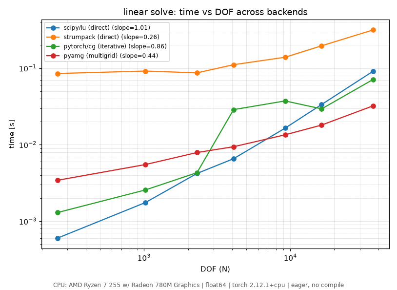
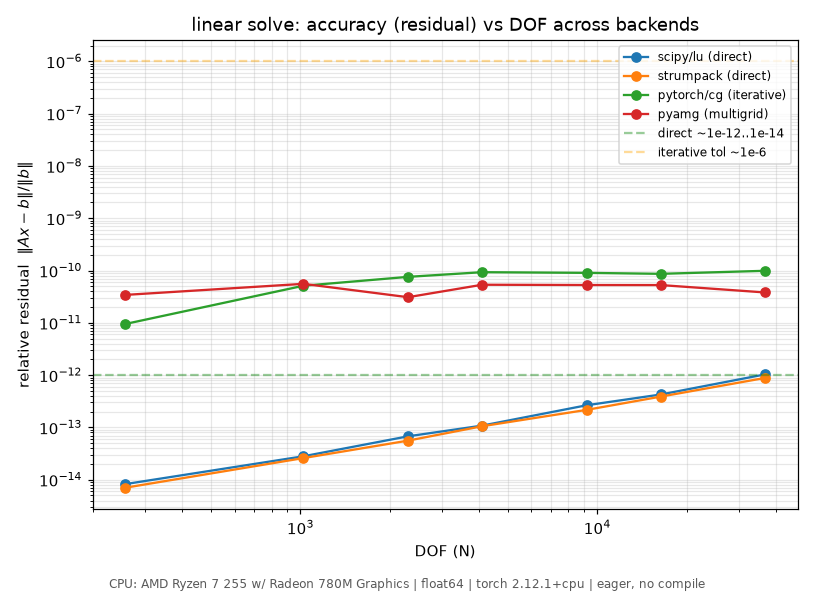

Backends and Capability Matrix
==============================

torch-sla dispatches each :func:`~torch_sla.solve` call to one of several
backends. Pick a backend explicitly via ``backend="..."`` or let
``backend="auto"`` choose based on device, dtype, problem size, and
which optional dependencies are installed.

The current backend lineup and what each supports:

.. list-table:: **Capability matrix**
   :widths: 11 8 8 8 10 12 10 10 10 10
   :header-rows: 1
   :class: capability-table

   * - Backend
     - CPU
     - CUDA
     - ROCm
     - Direct
     - Iterative
     - Complex
     - Batched
     - Distributed
     - Autograd
   * - ``scipy``
     - ✔
     - --
     - --
     - LU / UMFPACK
     - CG, BiCGStab, GMRES
     - ✔
     - via batch helpers
     - --
     - ✔
   * - ``pytorch``
     - ✔
     - ✔
     - ✔
     - --
     - CG, BiCGStab, GMRES, MINRES, LSQR, LSMR (+ PCG / PBiCGStab)
     - ✔
     - ✔
     - via ``DSparseTensor``
     - ✔
   * - ``strumpack``
     - ✔
     - ✔
     - ✔
     - LU (multifrontal)
     - --
     - ✔
     - --
     - --
     - ✔
   * - ``cudss``
     - --
     - ✔
     - --
     - LU / Cholesky / LDL\ :sup:`T` / LDL\ :sup:`H`
     - --
     - ✔
     - --
     - --
     - ✔
   * - ``pyamg``
     - ✔
     - ✔ (V-cycle only)
     - ✔ (V-cycle only)
     - --
     - Ruge-Stuben AMG, Smoothed Aggregation
     - --
     - --
     - --
     - ✔
   * - ``amgx``
     - --
     - ✔
     - --
     - --
     - AMG, PCG, PBiCGStab, FGMRES (NVIDIA AmgX)
     - --
     - --
     - --
     - ✔

.. note::

   **All six backends are verified correct.** Each is checked against a
   reference solution with the relative residual ‖Ax − b‖ / ‖b‖ at or near
   machine precision. The two direct GPU paths land well inside that
   envelope — measured ``strumpack`` ≈ ``3e-13`` and ``amgx`` ≈ ``5.6e-13``
   on the verification matrices.

.. note::

   ``cudss`` and ``pyamg`` are PyPI-installable, but the two **native
   compiled** backends — ``strumpack`` (``torch-strumpack``) and ``amgx``
   (``torch-amgx``) — ship as **prebuilt wheels on GitHub Releases** (not
   PyPI), and each wheel is ABI-tied to a specific CUDA *and* PyTorch
   version. See :ref:`prebuilt-native-wheels` in the installation guide for
   the wheel-selection rules and a concrete ``pip install --no-deps`` example.

----

The STRUMPACK backend
---------------------

``backend="strumpack"`` is a **portable multifrontal sparse direct
solver**. Unlike cuDSS (which is NVIDIA CUDA only), STRUMPACK runs on
**CPU, CUDA, and AMD ROCm** from the same API, supports both real and
complex matrices, and offers a multifrontal LU factorization. It is fully differentiable: gradients flow through the
adjoint (A\ :sup:`H`) solve, so it drops into autograd pipelines like the
other backends.

In practice STRUMPACK is the answer for a GPU **direct** solve on
hardware where cuDSS cannot go — most importantly AMD ROCm GPUs, where
cuDSS is unavailable. It requires the optional ``torch-strumpack``
package, published as **prebuilt wheels on GitHub Releases** (not PyPI;
see :ref:`prebuilt-native-wheels`) for Linux cpu / cuda / rocm and macOS
arm64. **Windows (CPU) is supported** — STRUMPACK builds on Windows with
``clang-cl`` (C/C++) + ``flang`` (Fortran) from conda-forge, linked against
MSVC-built PyTorch (a clean-env solve gives relative residual ~1.7e-16); a
prebuilt Windows wheel via CI is being added::

    # Grab the matching wheel from
    #   https://github.com/sparsexlab/torch-strumpack/releases
    pip install --no-deps <release-url>/torch_strumpack-...-linux_x86_64.whl

----

Platform availability
---------------------

Direct-solver backends bind to vendor libraries; the table below records
which OS each one builds on today.

.. list-table::
   :widths: 18 14 14 14 40
   :header-rows: 1

   * - Backend
     - Linux
     - Windows
     - macOS
     - Notes
   * - ``scipy``
     - ✔
     - ✔
     - ✔
     - Pure SciPy; UMFPACK optional via ``scikit-umfpack``.
   * - ``pytorch``
     - ✔
     - ✔
     - ✔
     - PyTorch-native; CUDA / ROCm path active when ``torch.cuda.is_available()``
       (ROCm torch builds report as ``cuda``).
   * - ``strumpack``
     - ✔
     - ✔ (CPU)
     - ✔ (arm64)
     - Multifrontal sparse direct solver (multifrontal LU,
       real + complex). CPU / CUDA / ROCm on Linux + macOS arm64 via
       ``torch-strumpack`` (GitHub-Release wheels,
       :ref:`prebuilt-native-wheels`). **Windows (CPU) supported** — builds
       with ``clang-cl`` + ``flang``; prebuilt Windows wheel via CI pending.
   * - ``cudss``
     - ✔
     - ✔
     - --
     - Requires ``nvmath-python[cu12]`` + NVIDIA CUDA. macOS is not
       supported by Nvidia.
   * - ``pyamg``
     - ✔
     - ✔
     - ✔
     - Setup runs on CPU via the optional ``pyamg`` dependency
       (``pip install pyamg``); the V-cycle dispatches through
       ``torch.sparse`` so the cycle itself runs on whatever device
       the matrix lives on. **Cross-platform AMG**: macOS gets CPU AMG,
       CUDA boxes get GPU V-cycles.

----

When ``backend="auto"`` picks what
----------------------------------

* **NVIDIA CUDA tensors**: try ``cudss`` (best direct solver) ->
  ``pytorch`` (iterative fallback).
* **AMD ROCm tensors**: cuDSS is **NVIDIA-only** and never runs here, so
  the auto path uses ``pytorch`` (iterative) and, when a direct solve is
  needed, ``strumpack`` (portable multifrontal direct solver on ROCm).
* **CPU tensors, small / medium**: prefer ``scipy`` LU.
* **CPU tensors, large or repeated**: ``pytorch`` CG / BiCGStab keeps the
  memory footprint flat.

Override via ``backend="..."`` whenever you need exact control (e.g.
``backend="cudss"`` to force a direct GPU solve on NVIDIA, or
``backend="strumpack"`` for a direct GPU solve on AMD ROCm where cuDSS is
unavailable).

----

.. _direct-vs-iterative:

Direct vs iterative: accuracy and complexity
---------------------------------------------

The accuracy tables quote ``~1e-14`` for the direct backends and ``~1e-6``
for the iterative ones. The gap is structural, not a bug:

* **Direct** solvers factor the matrix (``LU`` / ``Cholesky`` / ``LDL``) and
  back-substitute. The result is *exact up to floating-point round-off* --
  for a well-conditioned ``float64`` system the relative residual sits near
  machine epsilon (``~1e-14``..``1e-16``). There is no convergence knob; you
  pay the factorization cost once and get a fully accurate answer.
* **Iterative** solvers (CG, BiCGStab, GMRES, ...) refine a guess until the
  residual ``‖Ax − b‖ / ‖b‖`` drops below a *tolerance* you set (``atol`` /
  ``rtol``, default ``~1e-6``). They stop at the tolerance, so the answer is
  only as accurate as you ask for. Tighten ``atol`` toward ``1e-12`` and the
  residual follows -- at the cost of more iterations. The ill-conditioning of
  ``A`` (its condition number) sets how many iterations each digit costs.

So the iterative ``~1e-6`` is a *default stopping point*, not a precision
ceiling. The trade-off is what makes the iterative path scale: it never forms
the dense fill-in that a factorization does.

.. list-table:: Direct vs iterative cost (``n`` unknowns, ``nnz`` non-zeros, ``m`` iterations)
   :widths: 18 27 27 28
   :header-rows: 1

   * - Solver
     - Time
     - Space
     - Accuracy
   * - Direct (LU / Cholesky)
     - :math:`O(n^{1.5})` (2-D) to :math:`O(n^{2})` (3-D)
     - :math:`O(n\log n)` to :math:`O(n^{4/3})` fill-in
     - Exact to round-off (``~1e-14``)
   * - Iterative (CG / GMRES)
     - :math:`O(m\cdot nnz)`
     - :math:`O(n + nnz)`
     - Tolerance-limited (``atol``, default ``~1e-6``)

For a sparse PDE matrix ``nnz = O(n)``, so an iterative sweep costs
:math:`O(m\,n)` time in :math:`O(n)` memory, while the direct factorization's
fill-in is what exhausts memory past a few million unknowns (see the
:doc:`benchmarks`). Pick direct when you need the last digits or have many
right-hand sides to reuse a factorization on; pick iterative when the matrix
is large and ``~1e-6`` is enough.

Backend comparison (measured)
~~~~~~~~~~~~~~~~~~~~~~~~~~~~~~~

The two figures below put every available solve backend on the **same** 2D
Poisson sweep so they are directly comparable -- one for speed, one for
accuracy. They are produced by ``benchmarks/scaling/ops/solve_backends.py``;
backends absent on the measuring device are skipped (not faked). The device the
numbers were measured on is printed in the caption strip under each figure.

These were measured on the **CPU** host (AMD Ryzen 7 255), where the full
backend lineup is available -- ``scipy/lu`` and ``strumpack`` (direct),
``pytorch/cg`` (iterative), and ``pyamg`` (multigrid). The GPU-only direct
backend ``cudss`` is exercised separately (see the STRUMPACK / capability
sections above); run ``solve_backends.py --device cuda`` on an NVIDIA box to
overlay it on the same axes.

   **Speed.** Time vs DOF for each backend on one shared sweep (CPU host). The
   direct backends (``scipy/lu``, ``strumpack``) carry the factorization cost;
   the iterative ``pytorch/cg`` and the ``pyamg`` multigrid scale closer to
   linear. Slopes are fit per backend and shown in the legend. On an NVIDIA
   device ``cudss`` overlays as a third direct backend.

   **Accuracy.** The relative residual :math:`\|Ax-b\| / \|b\|` for the *same*
   solves. This is the structural gap above made visible: the direct backends
   sit near machine precision (``~1e-13``..``1e-14``), while the iterative ones
   plateau at their stopping tolerance -- the speed advantage of iterative
   solvers is bought with these digits of accuracy.

----

Putting it together
-------------------

The capability matrix maps directly to the :func:`~torch_sla.solve`
parameters: any combination where the cell is ✔ is supported::

    import torch
    from torch_sla import solve, PreconditionerConfig

    A_csr = ...                          # any accepted matrix format
    b = torch.randn(n)

    # Direct GPU solve, automatic Cholesky/LDL^H selection
    x = solve(A_csr, b, backend="cudss", matrix_type="auto")

    # CPU iterative CG with a tuned SSOR preconditioner
    x = solve(A_csr, b,
              backend="pytorch", method="cg",
              preconditioner=PreconditionerConfig(kind="ssor", omega=1.2),
              atol=1e-10, maxiter=5_000)

    # CPU iterative CG with a real multi-level AMG preconditioner
    # (uses PyAMG when installed, falls back to the lightweight
    # 2-level stub otherwise). Reduces the iteration count by 10-100x
    # on ill-conditioned PDE problems.
    x = solve(A_csr, b,
              backend="pytorch", method="cg",
              preconditioner="amg",  # or PreconditionerConfig(kind="amg", ...)
              atol=1e-10, maxiter=200)

    # Diagnostic return -- iteration count + residual
    x, info = solve(A_csr, b, return_info=True)
    print(info.iter_count, info.residual, info.converged)

----

Future backends (roadmap)
-------------------------

The next wave of backends will extend the table with cross-platform AMG
preconditioning and high-end GPU AMG:

.. list-table::
   :widths: 18 18 28 36
   :header-rows: 1

   * - Backend
     - Status
     - Capability
     - Notes
   * - ``pyamg``
     - **available** (this release)
     - CPU AMG setup + cross-device V-cycle
     - Already shipping. See above. Standalone solver +
       :class:`~torch_sla.backends.pyamg_backend.PyAMGHierarchy` for
       preconditioner re-use.
   * - ``amgx``
     - **available** (this release)
     - CUDA AMG + Krylov (Nvidia AmgX)
     - Linux + Windows only. NVIDIA GPU required (incl. Blackwell
       ``sm_120`` on cu12.8). Install the prebuilt wheel from
       `torch-amgx Releases <https://github.com/sparsexlab/torch-amgx/releases>`_
       (not PyPI; see :ref:`prebuilt-native-wheels`).
   * - ``petsc``
     - investigating
     - CPU/GPU direct + iterative, distributed (PETSc/hypre BoomerAMG)
     - Linux + macOS easy; Windows via WSL.
