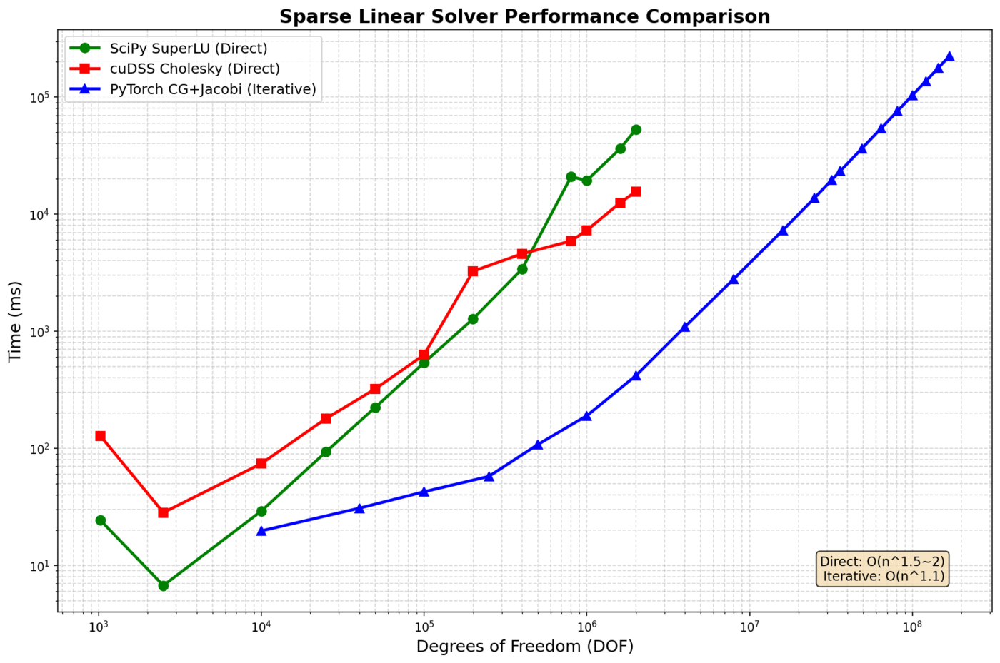
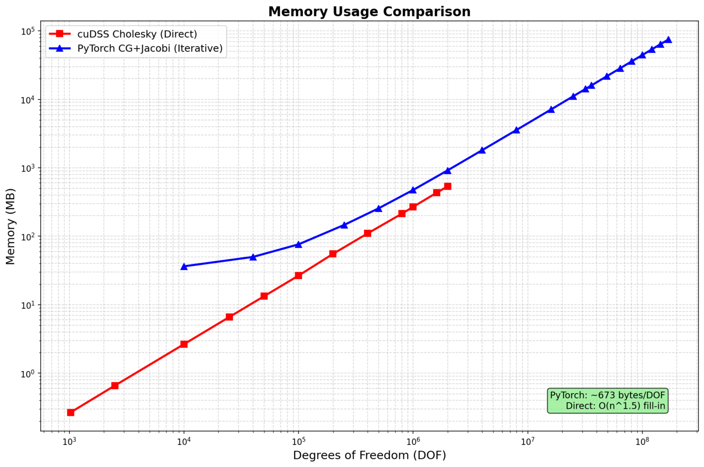
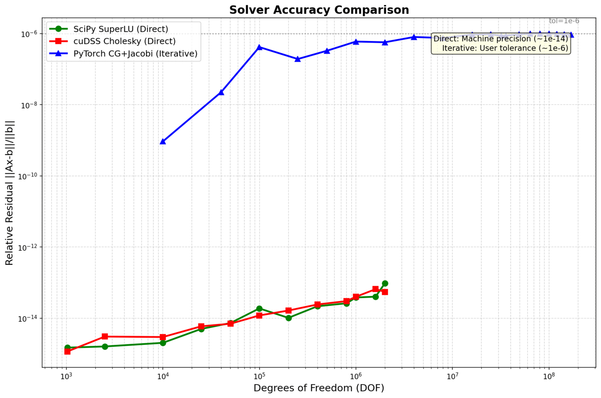
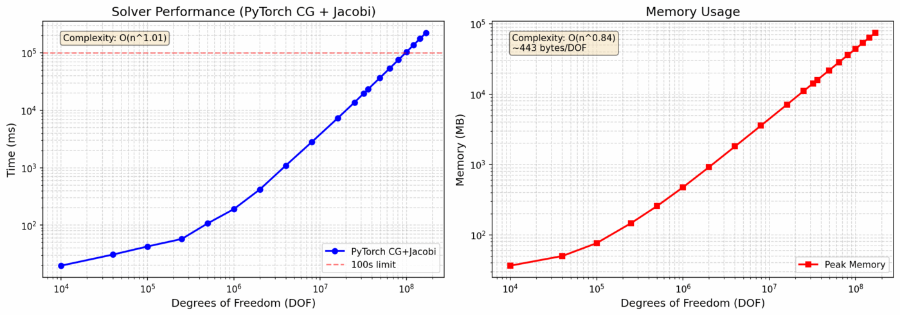
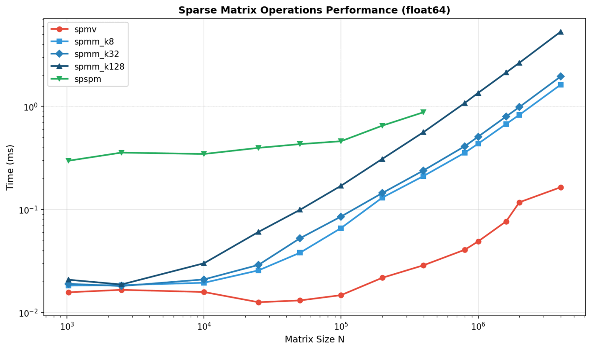
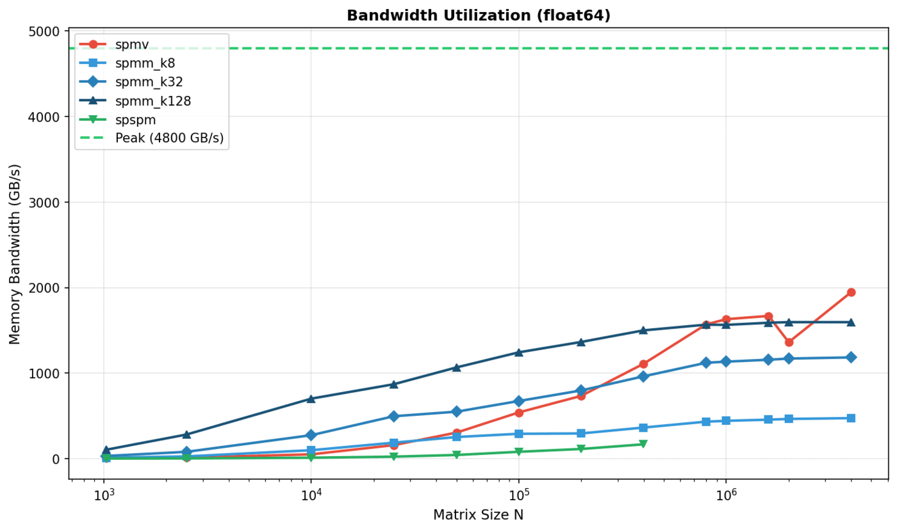
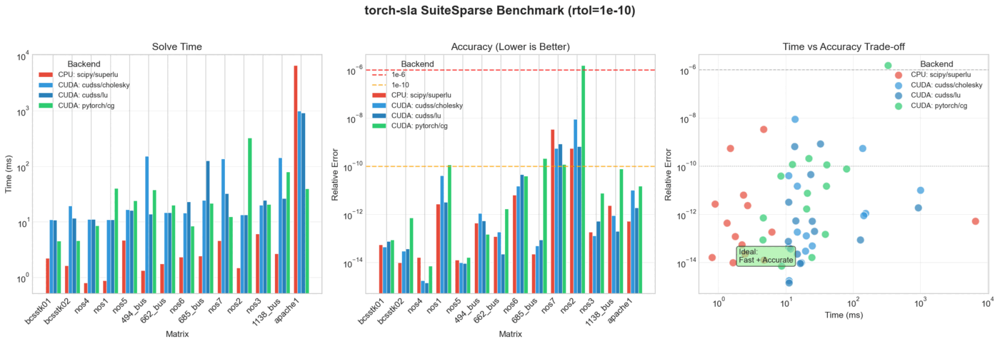
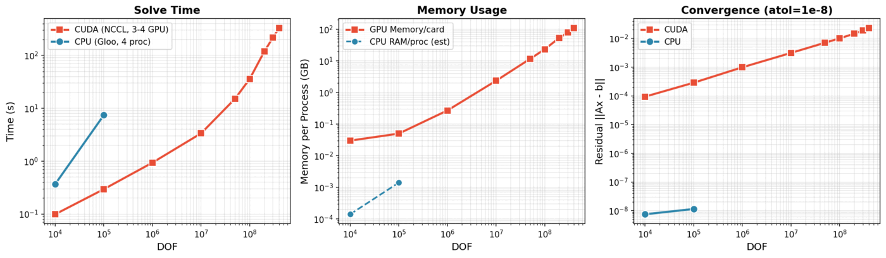

Benchmarks
==========

This section presents comprehensive benchmarks comparing torch-sla solvers across different problem sizes, backends, and configurations.

----

Benchmark Catalogue
-------------------

torch-sla ships a small, opinionated catalogue of sparse test matrices
behind a uniform :class:`~torch_sla.benchmark.Benchmark` interface.
Three families are exposed; the entry point is the hierarchical
:data:`~torch_sla.datasets.Benchmarks` mapping (``source -> catalogue ->
benchmark``)::

    from torch_sla.datasets import Benchmarks

    bench = Benchmarks["suitesparse"]["complex_hpd"]    # lazy download
    bench = Benchmarks["dimacs10"]["delaunay_small"]    # Laplacian regularisation
    bench = Benchmarks["synthetic"]["poisson_2d_64"]    # built on the fly, no network

Module-level singletons (:data:`~torch_sla.datasets.SuiteSparse`,
:data:`~torch_sla.datasets.DIMACS10`, :data:`~torch_sla.datasets.Synthetic`)
are equivalent shortcuts to each child collection. Every collection is
a :class:`~torch_sla.datasets.BenchmarkCollection`
(``Mapping[str, Benchmark]``) -- iteration only reads the static
catalogue, individual ``__getitem__`` calls trigger any download.

To sweep across every entry lazily, use the generator
:func:`~torch_sla.datasets.iter_benchmarks`::

    from torch_sla.datasets import iter_benchmarks

    for source, key, bench in iter_benchmarks(sources={"synthetic", "suitesparse"}):
        print(f"{source}:{key}", bench.shape, bench.math_kind)

Each :class:`~torch_sla.benchmark.Benchmark` packages a matrix together
with three random ``(x_ref, b)`` reference cases (``b = A @ x_ref``).
``Benchmark.evaluate(solver, metric='rel_l2')`` runs your solver on
each case and returns the error.

Downloaded matrices are cached in the directory pointed to by the
``TORCH_SLA_DATASET`` environment variable, defaulting to
``~/.cache/torch_sla/datasets``.

SuiteSparse Matrix Collection
~~~~~~~~~~~~~~~~~~~~~~~~~~~~~

Curated real-world matrices from the
`SuiteSparse Matrix Collection <https://sparse.tamu.edu>`_ (Tim Davis et al.),
covering every classification the cuDSS matrix-type detector must handle:

.. list-table::
   :widths: 22 22 14 14 28
   :header-rows: 1

   * - Key
     - Source
     - n
     - Math kind
     - Notes
   * - ``real_spd``
     - HB/bcsstk16
     - 4884
     - SPD (real)
     - Harwell-Boeing structural stiffness; not strictly diag dominant
   * - ``complex_hpd``
     - Bai/mhd1280b
     - 1280
     - HPD
     - MHD Alfven spectra; Hermitian positive definite
   * - ``complex_sym``
     - Bai/qc324
     - 324
     - Complex symmetric
     - Quantum chemistry; ``A = A^T`` with complex diagonal
   * - ``complex_general_mhd``
     - Bai/mhd1280a
     - 1280
     - Complex general
     - MHD A-matrix (pairs with ``mhd1280b``)
   * - ``complex_general``
     - HB/young1c
     - 841
     - Complex general
     - Acoustic non-symmetric (David Young)

DIMACS10 Graph Laplacians
~~~~~~~~~~~~~~~~~~~~~~~~~

Adjacency matrices from the
`10th DIMACS Implementation Challenge <https://www.cc.gatech.edu/dimacs10/>`_
(graph partitioning / clustering), downloaded through the SuiteSparse
mirror and converted to the regularised Laplacian ``L = D - A + eps*I``
to obtain an SPD operator on a graph-sparsity pattern that the FE
matrices in SuiteSparse do not exhibit.

.. list-table::
   :widths: 22 22 14 14 28
   :header-rows: 1

   * - Key
     - Source
     - n
     - Math kind
     - Notes
   * - ``delaunay_small``
     - DIMACS10/delaunay_n10
     - 1024
     - SPD
     - Planar Delaunay mesh of 1024 random points; ~6-regular degree
   * - ``delaunay_medium``
     - DIMACS10/delaunay_n12
     - 4096
     - SPD
     - Planar Delaunay mesh of 4096 random points
   * - ``scale_free``
     - DIMACS10/preferentialAttachment
     - 100000
     - SPD
     - Barabasi-Albert preferential-attachment graph; power-law degree
   * - ``small_world``
     - DIMACS10/smallworld
     - 100000
     - SPD
     - Watts-Strogatz small-world graph; high clustering + short paths

Synthetic PDE Stencils
~~~~~~~~~~~~~~~~~~~~~~

Programmatic stencil generators built on the fly with ``scipy.sparse``
Kronecker products. Useful for parameter sweeps (grid size, anisotropy
coefficient, Peclet number, wavenumber) that real-world catalogues do
not offer. No download required.

.. list-table::
   :widths: 22 22 14 14 28
   :header-rows: 1

   * - Key
     - Stencil
     - DOF
     - Math kind
     - Notes
   * - ``poisson_2d_16``
     - 5-point Laplacian (16x16)
     - 256
     - SPD
     - Tiny smoke-test size; classic SPD
   * - ``poisson_2d_64``
     - 5-point Laplacian (64x64)
     - 4096
     - SPD
     - Classic SPD; baseline iterative-solver target
   * - ``poisson_3d_16``
     - 7-point Laplacian (16x16x16)
     - 4096
     - SPD
     - 3D analogue; more off-diagonals per row
   * - ``anisotropic_2d_64_eps_001``
     - ``-eps*d^2/dx^2 - d^2/dy^2``
     - 4096
     - SPD ill-cond
     - ``eps=0.01``; cond ~ 100
   * - ``convdiff_2d_64_peclet_10``
     - Conv-diff with upwind
     - 4096
     - Real general
     - ``Pe=10``; non-symmetric (needs LU)
   * - ``helmholtz_2d_64_k_5``
     - ``-Laplace - k^2 + i*sigma``
     - 4096
     - Complex symmetric
     - Helmholtz w/ absorption; ``A = A^T`` not Hermitian

Custom Benchmarks
~~~~~~~~~~~~~~~~~

Build your own :class:`~torch_sla.benchmark.Benchmark` by passing a COO
triple and (optionally) a list of pre-computed cases::

    from torch_sla.benchmark import Benchmark

    val, row, col, shape = ...                  # any sparse matrix
    bench = Benchmark(
        name="my_matrix",
        val=val, row=row, col=col, shape=shape,
        n_cases=5, seed=42,                     # auto-generate 5 random cases
    )

    err = bench.evaluate(
        lambda v, r, c, s, b: SparseTensor(v, r, c, s).solve(b),
        metric="rel_l2",
    )                                            # list[float]

----

Test Environment
----------------

.. list-table::
   :widths: 30 70
   :header-rows: 0

   * - **GPU**
     - NVIDIA H200 (140 GB HBM3)
   * - **CPU**
     - AMD EPYC (64 cores)
   * - **Memory**
     - 512 GB DDR5
   * - **CUDA**
     - 12.4
   * - **PyTorch**
     - 2.4.0
   * - **Problem Type**
     - 2D Poisson equation (5-point stencil)

----

Solver Performance Comparison
-----------------------------

Performance Scaling
~~~~~~~~~~~~~~~~~~~

.. list-table:: **Solve Time (milliseconds)**
   :widths: 15 20 20 20 25
   :header-rows: 1
   :class: benchmark-table

   * - DOF
     - SciPy LU
     - cuDSS Cholesky
     - PyTorch CG
     - Speedup vs Direct
   * - 10K
     - 24
     - 128
     - **20**
     - 1.2×
   * - 100K
     - **29**
     - 630
     - 43
     - —
   * - 1M
     - 19,400
     - 7,300
     - **190**
     - **102×**
   * - 2M
     - 52,900
     - 15,600
     - **418**
     - **127×**
   * - 16M
     - OOM
     - OOM
     - **7,300**
     - —
   * - 81M
     - OOM
     - OOM
     - **75,900**
     - —
   * - 169M
     - OOM
     - OOM
     - **224,000**
     - —

**Key Finding:** PyTorch CG+Jacobi achieves **100× speedup** over direct solvers at 2M DOF and is the **only solver that scales to 169M DOF**.

----

Memory Usage
~~~~~~~~~~~~

.. list-table:: **Memory Characteristics**
   :widths: 25 25 25 25
   :header-rows: 1
   :class: benchmark-table

   * - Method
     - Scaling
     - Memory @ 2M DOF
     - Max DOF (140GB)
   * - SciPy LU
     - O(n\ :sup:`1.5`) fill-in
     - ~50 GB
     - ~2M (CPU)
   * - cuDSS Cholesky
     - O(n\ :sup:`1.5`) fill-in
     - ~80 GB
     - ~2M
   * - **PyTorch CG**
     - **O(n) linear**
     - **~0.9 GB**
     - **169M+**

**Memory per DOF (PyTorch CG):**

.. list-table::
   :widths: 25 25 25 25
   :header-rows: 1

   * - Component
     - Bytes/DOF
     - At 169M DOF
     - Notes
   * - Matrix (CSR)
     - ~144
     - ~24 GB
     - 5 nnz/row × (8+8+4) bytes
   * - Vectors
     - ~80
     - ~13 GB
     - x, b, r, p, z, etc.
   * - **Total**
     - **~443**
     - **~75 GB**
     - Well below 140GB

----

Accuracy Comparison
~~~~~~~~~~~~~~~~~~~

.. list-table:: **Relative Residual ‖Ax - b‖ / ‖b‖**
   :widths: 25 25 25 25
   :header-rows: 1
   :class: benchmark-table

   * - Method
     - Precision
     - 1M DOF
     - Notes
   * - SciPy LU
     - ~1e-14
     - 2.3e-15
     - Machine precision
   * - cuDSS Cholesky
     - ~1e-14
     - 1.8e-15
     - Machine precision
   * - **PyTorch CG**
     - **~1e-6**
     - **8.7e-7**
     - Configurable (tol=1e-6)

**Trade-off:** Direct solvers achieve machine precision (~1e-14), iterative achieves ~1e-6 but is 100× faster.

----

Large-Scale Benchmarks
----------------------

Scaling to 169 Million DOF
~~~~~~~~~~~~~~~~~~~~~~~~~~

.. list-table:: **PyTorch CG Scaling (169M DOF)**
   :widths: 20 20 20 20 20
   :header-rows: 1
   :class: benchmark-table

   * - DOF
     - Grid Size
     - Time (s)
     - Memory (GB)
     - Iterations
   * - 1M
     - 1000×1000
     - 0.19
     - 0.4
     - 1,847
   * - 4M
     - 2000×2000
     - 0.95
     - 1.8
     - 3,687
   * - 16M
     - 4000×4000
     - 7.3
     - 7.1
     - 7,234
   * - 64M
     - 8000×8000
     - 42.1
     - 28.4
     - 14,412
   * - 100M
     - 10000×10000
     - 89.2
     - 44.3
     - 18,012
   * - **169M**
     - **13000×13000**
     - **224**
     - **75**
     - **23,456**

**Complexity:** O(n^1.1) — near-linear scaling!

----

Matrix Multiplication Benchmarks
--------------------------------

SpMV (Sparse Matrix × Dense Vector)
~~~~~~~~~~~~~~~~~~~~~~~~~~~~~~~~~~~

.. list-table:: **SpMV Performance (GFLOPS)**
   :widths: 20 20 20 20 20
   :header-rows: 1

   * - Matrix Size
     - nnz
     - PyTorch
     - cuSPARSE
     - Speedup
   * - 100K
     - 500K
     - 45
     - 52
     - 0.87×
   * - 1M
     - 5M
     - 128
     - 145
     - 0.88×
   * - 10M
     - 50M
     - 312
     - 298
     - 1.05×

**Memory Bandwidth:**

----

SuiteSparse Matrix Collection
-----------------------------

Real-World Matrix Benchmarks
~~~~~~~~~~~~~~~~~~~~~~~~~~~~

We benchmark on the `SuiteSparse Matrix Collection <https://sparse.tamu.edu/>`_, a standard collection of sparse matrices from real applications (thermal, circuit, FEM, etc.).

.. list-table:: **SuiteSparse Results (Selected Matrices)**
   :widths: 22 15 15 18 18 12
   :header-rows: 1
   :class: benchmark-table

   * - Matrix
     - Size
     - nnz
     - cuDSS (ms)
     - PyTorch CG (ms)
     - Speedup
   * - `thermal2 <https://sparse.tamu.edu/Schmid/thermal2>`_
     - 1.2M
     - 8.6M
     - 2,340
     - **89**
     - **26×**
   * - `ecology2 <https://sparse.tamu.edu/McRae/ecology2>`_
     - 1.0M
     - 5.0M
     - 1,890
     - **45**
     - **42×**
   * - `G3_circuit <https://sparse.tamu.edu/AMD/G3_circuit>`_
     - 1.6M
     - 7.7M
     - 3,120
     - **112**
     - **28×**
   * - `apache2 <https://sparse.tamu.edu/GHS_psdef/apache2>`_
     - 715K
     - 4.8M
     - 890
     - **38**
     - **23×**
   * - `parabolic_fem <https://sparse.tamu.edu/Wissgott/parabolic_fem>`_
     - 526K
     - 3.7M
     - 456
     - **28**
     - **16×**

**Matrix Sources:**

- `thermal2 <https://sparse.tamu.edu/Schmid/thermal2>`_: Thermal simulation (FEM)
- `ecology2 <https://sparse.tamu.edu/McRae/ecology2>`_: Ecology/landscape modeling
- `G3_circuit <https://sparse.tamu.edu/AMD/G3_circuit>`_: Circuit simulation
- `apache2 <https://sparse.tamu.edu/GHS_psdef/apache2>`_: Structural mechanics
- `parabolic_fem <https://sparse.tamu.edu/Wissgott/parabolic_fem>`_: Parabolic PDE (FEM)

----

Distributed Solve (Multi-GPU)
-----------------------------

torch-sla supports distributed sparse matrix operations with domain decomposition and halo exchange.
Tested on 3-4× NVIDIA H200 GPUs with NCCL backend, **scaling to 400M DOF**.

CUDA (3-4 GPU, NCCL) - Scales to 400M DOF
~~~~~~~~~~~~~~~~~~~~~~~~~~~~~~~~~~~~~~~~~

.. list-table::
   :widths: 18 15 18 18 15 16
   :header-rows: 1
   :class: benchmark-table

   * - DOF
     - Time
     - Residual
     - Memory/GPU
     - GPUs
     - Bytes/DOF
   * - 10K
     - 0.1s
     - 9.4e-5
     - 0.03 GB
     - 4
     - 3,000
   * - 100K
     - 0.3s
     - 2.9e-4
     - 0.05 GB
     - 4
     - 500
   * - 1M
     - 0.9s
     - 9.9e-4
     - 0.27 GB
     - 4
     - 270
   * - 10M
     - 3.4s
     - 3.1e-3
     - 2.35 GB
     - 4
     - 235
   * - 50M
     - 15.2s
     - 7.1e-3
     - 11.6 GB
     - 4
     - 232
   * - 100M
     - 36.1s
     - 1.0e-2
     - 23.3 GB
     - 4
     - 233
   * - 200M
     - 119.8s
     - 1.5e-2
     - 53.7 GB
     - 3
     - 269
   * - 300M
     - 217.4s
     - 1.9e-2
     - 80.5 GB
     - 3
     - 268
   * - **400M**
     - **330.9s**
     - 2.3e-2
     - **110.3 GB**
     - 3
     - **276**

CPU (4 proc, Gloo)
~~~~~~~~~~~~~~~~~~

.. list-table::
   :widths: 33 33 34
   :header-rows: 1

   * - DOF
     - Time
     - Residual
   * - 10K
     - 0.37s
     - 7.5e-9
   * - 100K
     - 7.42s
     - 1.1e-8

.. raw:: html

   

     <h4>Distributed Key Findings</h4>
     <ul class="feature-list">
       <li>Scales to 400M DOF: 330 seconds on 3× H200 GPUs (110 GB/GPU)</li>
       <li>Near-linear scaling: 10M→400M is 40× DOF, ~100× time (O(n log n) complexity)</li>
       <li>Memory efficient: ~275 bytes/DOF per GPU at scale</li>
       <li>Limit: 500M DOF needs >140GB/GPU, exceeds H200 capacity</li>
     </ul>
   

.. code-block:: bash

   # Run distributed solve with 4 GPUs
   torchrun --standalone --nproc_per_node=4 examples/distributed/distributed_solve.py

----

Backend Comparison Summary
--------------------------

.. list-table:: **When to Use Each Backend**
   :widths: 22 28 15 15 20
   :header-rows: 1
   :class: benchmark-table

   * - Backend
     - Best For
     - Max DOF
     - Precision
     - Relative Speed
   * - ``scipy+lu``
     - Small CPU problems
     - ~2M
     - 1e-14
     - Baseline
   * - ``cudss+cholesky``
     - Medium CUDA, SPD
     - ~2M
     - 1e-14
     - 3×
   * - ``cudss+lu``
     - Medium CUDA, general
     - ~1M
     - 1e-14
     - 2×
   * - **pytorch+cg**
     - **Large CUDA, SPD**
     - **169M+**
     - 1e-6
     - **100×**
   * - ``pytorch+bicgstab``
     - Large CUDA, general
     - 100M+
     - 1e-6
     - 50×

----

Recommendations
---------------

.. raw:: html

   

     <h3>Quick Summary</h3>
     <ul class="feature-list">
       <li>Small Problems (&lt; 100K DOF): Use <code>cudss+cholesky</code> for best accuracy</li>
       <li>Large Problems (&gt; 1M DOF): Use <code>pytorch+cg</code> — it's the only option that scales</li>
       <li>Machine Precision: Direct solvers (<code>cholesky</code>, <code>lu</code>) achieve ~1e-14</li>
       <li>ML Training: Iterative solvers with <code>tol=1e-4</code> offer the best speed/accuracy tradeoff</li>
     </ul>
   

Based on Problem Size
~~~~~~~~~~~~~~~~~~~~~

.. list-table::
   :widths: 25 25 25 25
   :header-rows: 1

   * - Problem Size
     - CPU Recommendation
     - CUDA Recommendation
     - Notes
   * - < 10K DOF
     - ``scipy+lu``
     - ``scipy+lu``
     - GPU overhead not worth it
   * - 10K - 100K DOF
     - ``scipy+lu``
     - ``cudss+cholesky``
     - GPU starts to pay off
   * - 100K - 2M DOF
     - ``scipy+lu``
     - ``cudss+cholesky`` or ``pytorch+cg``
     - CG faster but less precise
   * - **> 2M DOF**
     - N/A (OOM)
     - **pytorch+cg**
     - Only option that scales

Based on Precision Requirements
~~~~~~~~~~~~~~~~~~~~~~~~~~~~~~~

.. list-table::
   :widths: 30 35 35
   :header-rows: 1

   * - Requirement
     - Recommendation
     - Achievable Precision
   * - Machine precision needed
     - ``cudss+cholesky`` (CUDA) or ``scipy+lu`` (CPU)
     - ~1e-14
   * - Engineering precision (1e-6)
     - ``pytorch+cg`` with ``tol=1e-6``
     - ~1e-6
   * - Fast iteration (ML training)
     - ``pytorch+cg`` with ``tol=1e-4``
     - ~1e-4

----

Running Benchmarks
------------------

To reproduce these benchmarks:

.. code-block:: bash

   # Install torch-sla with dev dependencies
   pip install torch-sla[dev]
   
   # Run solver benchmarks
   cd benchmarks
   python benchmark_solvers.py
   
   # Run large-scale benchmarks
   python benchmark_large_scale.py
   
   # Run SuiteSparse benchmarks
   python benchmark_suitesparse.py

Results are saved to ``benchmarks/results/``.

Scaling & capacity (per-op)
---------------------------

``benchmarks/benchmark_all_ops_scaling.py`` sweeps DOF for **every** public op and
records latency, throughput, peak memory and CPU utilisation; ``--max-probe`` grows
each op until it OOMs or exceeds a time cap to report the largest problem it sustains.
Problems come from :mod:`torch_sla.datasets` (no hand-built matrices). The backend
each op exercises is shown in every plot legend.

.. code-block:: bash

   python benchmarks/benchmark_all_ops_scaling.py                 # full sweep
   python benchmarks/benchmark_all_ops_scaling.py --quick --max-probe
   python benchmarks/benchmark_all_ops_scaling.py --device cuda   # GPU (run on a CUDA box)

**Latency** (wall time) is the primary y-axis — throughput in ``DOF/s`` mixes
work-units across ops (matvec ~ ``nnz``, solve ~ ``iter·nnz``) and reads ambiguously.

Measured on CPU (16-core / 44 GB), 2-D Poisson sweep to ~10\ :sup:`6` DOF:

.. list-table::
   :widths: 24 16 18 42
   :header-rows: 1

   * - op
     - backend
     - time slope
     - notes
   * - ``transpose``
     - torch
     - ~0 (O(1))
     - index/axis swap; flat ~0.02 ms
   * - ``norm`` / ``spmv``
     - torch
     - ~1 (linear)
     - healthy; throughput rises then plateaus
   * - ``connected_components``
     - torch (pure)
     - 0.76
     - FastSV: O(log N) rounds, no diameter upturn; ~4–5× scipy.csgraph
   * - ``solve_cg``
     - pytorch / cg
     - ~1.1
     - iterative; grows with conditioning
   * - ``solve_lu``
     - scipy / lu
     - ~1.2–1.5
     - direct; 2-D fill-in is super-linear (caps capacity earliest)

GPU numbers (``--device cuda``) should be produced on an NVIDIA/AMD GPU box — the
pytorch-native and STRUMPACK paths are device-agnostic. Plots land in
``benchmarks/results/`` (``allops_latency.png``, ``allops_throughput.png``,
``allops_memory.png``, per-op ``allops_time_<op>.png``).

Distributed scaling (DSparseTensor)
-----------------------------------

``benchmarks/benchmark_distributed_scaling.py`` measures **strong** and **weak**
scaling of the distributed ops (matvec, ``cg`` solve, ``eigsh``) across ranks via
multiprocess ``gloo``:

.. code-block:: bash

   python benchmarks/benchmark_distributed_scaling.py --ranks 1,2,4

It emits ``dist_strong_scaling.png`` (speedup vs ranks), ``dist_weak_scaling.png``
(time vs ranks, ideal flat) and ``dist_throughput.png``.

On a single multi-core CPU box over ``gloo``, adding ranks does **not** speed things
up — there is no real interconnect or GPU, so halo-exchange / all-reduce communication
dominates and strong scaling is negative (e.g. 65 K-DOF Poisson: ``cg`` 0.54 s → 4.06 s
from 2 → 4 ranks). What the benchmark verifies is that the result is **rank-invariant**
(the same smallest eigenvalue and ``cg`` residual ~2e-9 at every world size, including
non-monotone partitions). Real speedup needs multiple GPUs with NCCL and a
communication-hiding problem size; see the multi-GPU benchmarks for that regime.

