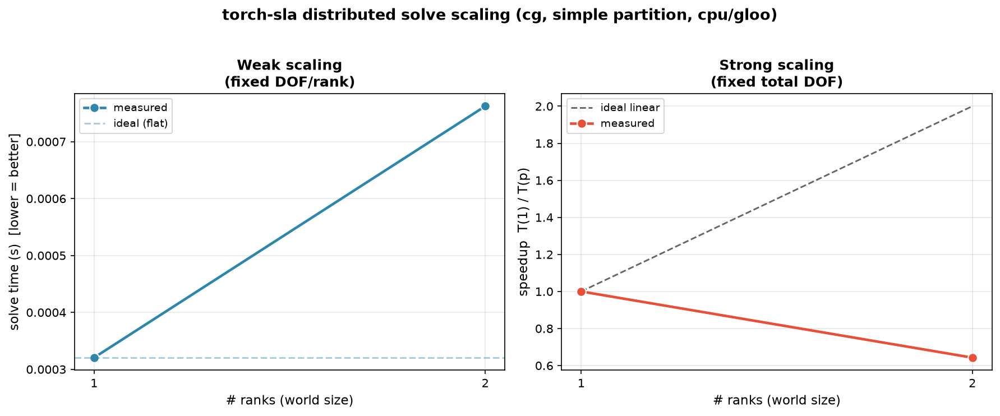

Distributed solve scaling
=========================

This page is the **hand-off guide** for the distributed linear-solve
scaling benchmark. It explains how to launch the canonical script on a
multi-GPU node (or multi-process CPU), what each recorded metric means,
how to read the resulting plot, and how to extend the benchmark with a
new solver, partitioner, or problem.

The benchmark lives at

.. code-block:: text

   benchmarks/distributed/scaling/distributed_solve_scaling.py

and is the single, canonical entry point for distributed-solve scaling.
It builds a row-sharded :class:`~torch_sla.DSparseTensor` from a
reproducible Poisson problem (:mod:`torch_sla.datasets`), runs the
unified distributed :func:`~torch_sla.solve`, and records wall-clock
solve time, the relative residual ``||A x - b|| / ||b||`` (the
correctness gate), throughput, and parallel efficiency.

What it measures
----------------

Three experiment modes, selected with ``--mode``:

.. list-table::
   :widths: 18 47 35
   :header-rows: 1

   * - Mode
     - What is held fixed / varied
     - Ideal curve
   * - ``weak``
     - Fixed DOF **per rank**; total DOF grows with the world size.
     - Solve time is **flat** as ranks grow.
   * - ``strong``
     - Fixed **total** DOF; world size grows.
     - Solve time **halves** each time ranks double (linear speedup).
   * - ``throughput``
     - DOF processed per second vs ranks (derived from the timed solve).
     - Throughput grows **linearly** with ranks.

All three are derived from the *same* instrumented solve, so a single
launch at a given world size records everything for that world size. The
JSON and plot **accumulate** across world sizes: run the script once per
``--nproc_per_node`` value and the rows append into one file. The
``p=1`` run establishes the baseline that efficiency and speedup are
measured against, so **always run** ``--nproc_per_node=1`` **first**.

Hardware and launch model
-------------------------

The benchmark is launched with ``torchrun``, which spawns one process
(*rank*) per ``--nproc_per_node`` and sets the standard environment
variables the script reads:

* ``WORLD_SIZE`` -- total number of ranks across all nodes.
* ``RANK`` -- this process's global rank (``0 .. WORLD_SIZE-1``).
* ``LOCAL_RANK`` -- this process's rank within its node; used to pick
  the GPU via ``torch.cuda.set_device(LOCAL_RANK)``.

The backend is chosen automatically: **NCCL** when CUDA is available
(one rank per GPU), **gloo** on CPU (multi-process CPU, useful for
exercising the distributed code paths on a single-GPU or CPU-only box).

Single node, multiple GPUs
~~~~~~~~~~~~~~~~~~~~~~~~~~~~

.. code-block:: bash

   # one rank per GPU on the local node
   torchrun --standalone --nproc_per_node=4 \
       benchmarks/distributed/scaling/distributed_solve_scaling.py \
       --mode weak --dof-per-rank 100000

``--standalone`` runs a single-node rendezvous on a free local port; no
addresses to configure.

Multiple nodes
~~~~~~~~~~~~~~~

.. code-block:: bash

   # on every node (HEAD_NODE_IP reachable by all, same --nnodes/--rdzv-id):
   torchrun \
       --nnodes=2 --nproc_per_node=4 \
       --rdzv-id=sla-scaling --rdzv-backend=c10d \
       --rdzv-endpoint=HEAD_NODE_IP:29500 \
       benchmarks/distributed/scaling/distributed_solve_scaling.py \
       --mode weak --dof-per-rank 100000

NCCL environment variables worth knowing on multi-node clusters:

.. code-block:: bash

   export NCCL_DEBUG=INFO          # print the transport NCCL selected
   export NCCL_SOCKET_IFNAME=eth0  # pin the NIC if auto-detect picks the wrong one
   export NCCL_IB_DISABLE=0        # keep InfiniBand on (1 to force TCP)

Copy-paste launch commands
--------------------------

Run the ``p=1`` baseline first, then the larger world sizes. The JSON
and plot accumulate, so just re-launch with a different
``--nproc_per_node``.

**Weak scaling** (fixed DOF/rank):

.. code-block:: bash

   for P in 1 2 4 8; do
     torchrun --standalone --nproc_per_node=$P \
       benchmarks/distributed/scaling/distributed_solve_scaling.py \
       --mode weak --dof-per-rank 100000 --method cg --partitioner simple
   done

**Strong scaling** (fixed total DOF):

.. code-block:: bash

   for P in 1 2 4 8; do
     torchrun --standalone --nproc_per_node=$P \
       benchmarks/distributed/scaling/distributed_solve_scaling.py \
       --mode strong --total-dof 4000000 --method cg --partitioner simple
   done

**Throughput** curve (re-uses the weak rows; or run dedicated points):

.. code-block:: bash

   for P in 1 2 4 8; do
     torchrun --standalone --nproc_per_node=$P \
       benchmarks/distributed/scaling/distributed_solve_scaling.py \
       --mode throughput --dof-per-rank 100000
   done

Render the accumulated plot + table at any time (no ``torchrun``):

.. code-block:: bash

   python benchmarks/distributed/scaling/distributed_solve_scaling.py --plot-only

Example output
--------------

The block below is **example output from a 1- and 2-rank CPU/gloo smoke
test** on a single iGPU box (``macor7``), confirming the script runs
end-to-end and the correctness gate passes (residual at machine
precision). The numbers are tiny by design -- *real multi-GPU scaling is
the hand-off person's job*; replace this with NCCL multi-GPU runs.

.. code-block:: text

   ==============================================================================
   WEAK SCALING
   ==============================================================================
    ranks   DOF(global)   DOF/rank    time(s)    rel.res    thr(DOF/s)  efficiency
        1        10,000     10,000     0.0003   3.05e-13    31,201,532      100.0%
        2        19,881      9,940     0.0008   5.45e-13    26,079,256       42.0%

   ==============================================================================
   STRONG SCALING
   ==============================================================================
    ranks   DOF(global)   DOF/rank    time(s)    rel.res    thr(DOF/s)  efficiency
        1        19,881     19,881     0.0005   5.31e-13    36,180,624      100.0%
        2        19,881      9,940     0.0009   5.45e-13    23,255,295       32.1%

Outputs:

.. code-block:: text

   benchmarks/results/distributed_solve_scaling.json   # all rows (accumulating)
   assets/benchmarks/distributed_solve_scaling.png     # weak / strong / throughput panels

Reading the metrics
-------------------

.. list-table::
   :widths: 22 78
   :header-rows: 1

   * - Metric
     - Meaning
   * - ``world_size``
     - Number of ranks (= GPUs for NCCL, = processes for gloo/CPU).
   * - ``DOF(global)`` / ``DOF/rank``
     - Total degrees of freedom and this rank's owned share. In ``weak``
       mode DOF/rank is held roughly fixed; in ``strong`` mode DOF/rank
       shrinks as ranks grow.
   * - ``time(s)``
     - Wall-clock solve time, **best of** ``--repeat`` timed solves, with
       a barrier + (CUDA) ``synchronize`` around each so all ranks are
       measured together.
   * - ``rel.res``
     - Relative residual ``||A x - b|| / ||b||`` -- the **correctness
       gate**. Computed from public ops only (``D @ x`` + an all-reduced
       sum of squared owned residuals, never a full gather). A converged
       SPD CG solve should land near the requested ``--rtol`` (well below
       ``1e-4``); a large residual means the solve did **not** converge.
   * - ``thr(DOF/s)``
     - ``DOF(global) / time`` -- problem throughput.
   * - ``efficiency``
     - Parallel efficiency vs the ``p=1`` baseline (ideal = 100%):
       weak ``= T(1)/T(p)``; strong ``= T(1)/(p·T(p))``;
       throughput ``= (thr(p)/p)/thr(1)``.

.. note::

   ``iterations`` is recorded as ``null``. The distributed Krylov shard
   solvers (:meth:`~torch_sla.DSparseTensor.solve_distributed_shard`)
   return only the solution vector; iteration count is not exposed by the
   public API. The relative residual is the authoritative correctness
   signal. If per-iteration counts are needed later, thread an iteration
   counter out of ``torch_sla/distributed/solve.py`` (``cg_shard`` et al.)
   and populate the ``iterations`` field.

What good scaling looks like, and caveats
-----------------------------------------

* **Weak scaling** -- the solve-time curve should stay close to flat. A
  gentle upward slope is expected because each Krylov iteration costs one
  ``all_reduce`` (for the dot products) plus a halo exchange, and that
  communication grows slowly with rank count.
* **Strong scaling** -- speedup should track the dashed ideal-linear line
  at first, then bend over once the per-rank problem becomes too small to
  hide communication. The knee is the useful signal: it tells you the
  smallest DOF/rank that still scales.
* **Throughput** -- should rise roughly linearly with ranks while the
  problem stays compute-bound, then flatten when communication dominates.

Caveats the hand-off person should keep in mind:

* **Communication scales with halo size, not DOF.** What crosses the wire
  each iteration is (a) a few scalars per ``all_reduce`` and (b) the halo
  (ghost) entries exchanged before each SpMV. Halo size depends on the
  **partitioner**: ``metis`` minimizes edge cut (smallest halo, best
  scaling) but costs more to build; ``simple`` (contiguous blocks) is
  cheap but can produce large halos for irregular graphs; ``coordinate``
  (RCB, geometric) is a middle ground for grid-like problems and needs
  node coordinates (synthesized from the Poisson grid here).
* **CPU/gloo has no compute to hide comm behind.** On a single CPU box
  the gloo runs pay the collective cost with no real network or GPU
  parallelism, so strong-scaling efficiency is expected to be poor. Use
  CPU/gloo to validate **correctness and code paths**, NCCL multi-GPU to
  measure **real scaling**.
* **Bytes per DOF per GPU** -- on NCCL, watch the ratio of halo bytes to
  owned DOF. Larger per-rank problems amortize the halo better; that is
  why weak scaling usually looks healthier than strong.

How to extend it
----------------

The script is structured so each axis is a small, isolated change:

* **Add a solver / method.** Pass ``--method bicgstab`` (or ``gmres`` /
  ``minres``); anything ``solve_distributed_shard`` accepts works. To add
  a brand-new method, implement ``<name>_shard`` in
  ``torch_sla/distributed/solve.py`` and wire it into
  ``solve_distributed_shard``; no benchmark change is needed.
* **Add a partitioner.** Extend ``_PARTITIONER_ALIASES`` in the script,
  mapping your CLI name to ``(method_string, needs_coords)`` understood by
  :func:`torch_sla.partition.resolve_partition_ids`. If it needs
  coordinates, ``_grid_coords`` already synthesizes them for the Poisson
  grid.
* **Add a problem.** ``build_problem`` calls
  :func:`torch_sla.datasets.poisson_2d` / ``poisson_3d``. Swap in any
  generator returning a :class:`~torch_sla.datasets.SparseProblem` (it
  must carry ``val/row/col/shape`` and an ``rhs``); add a ``--problem``
  flag and branch inside ``build_problem``. Keep the fixed ``SEED`` so
  runs stay reproducible.

The recorded JSON schema is stable (one row per
``(mode, world_size, dof_per_rank, partitioner, method)``), so external
tooling can read ``benchmarks/results/distributed_solve_scaling.json``
directly.
