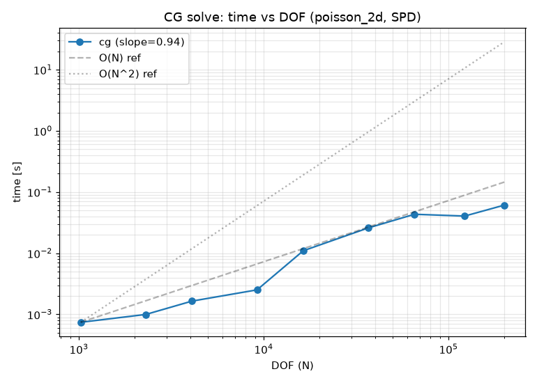
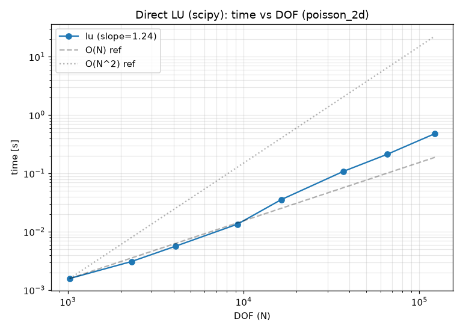
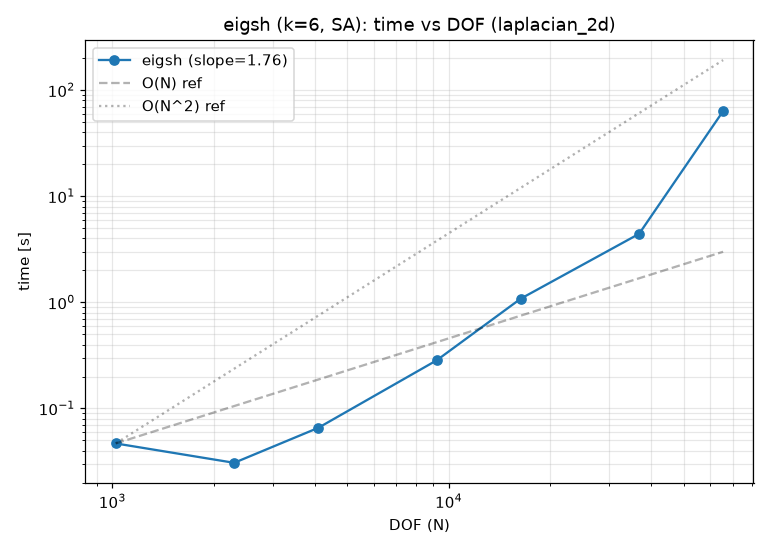
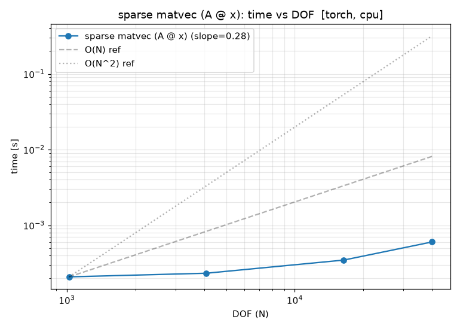
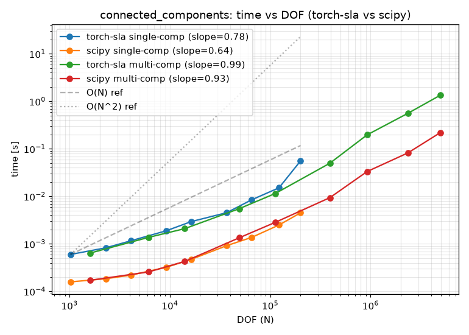
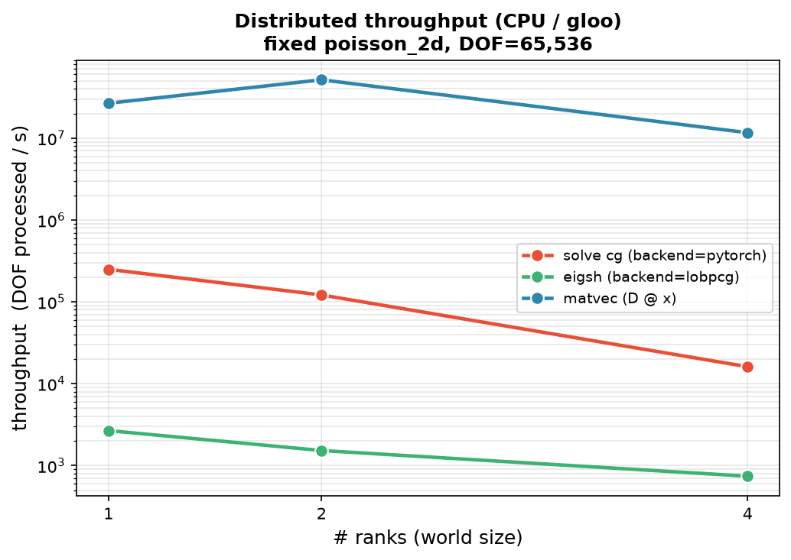

Operations
==========

This is the per-operation reference. Operations are grouped by category;
each entry gives the signature, a one-line summary, a runnable example, an
input/output visualization, which class(es) it is available on, the API link,
and -- where measured -- a scaling plot. The two classes that carry these
operations are :class:`~torch_sla.SparseTensor` (single process, see
:doc:`sparse_tensor`) and :class:`~torch_sla.DSparseTensor` (distributed, see
:doc:`dsparse_tensor`).

Throughout, ``A`` is a sparse matrix built from a 2D Poisson stencil; its
sparsity pattern looks like:

.. figure:: ../../assets/examples/spy_poisson_50x50.png
   :width: 50%
   :align: center

   ``A.spy()`` for a 50×50 grid (2,500 DOF) -- the banded 5-point stencil.

Scaling plots come from ``benchmarks/benchmark_all_ops_scaling.py`` (CPU = AMD
Ryzen 7 255; CUDA = RTX 4070 Ti SUPER). See :doc:`benchmarks` for the full
methodology and the large-scale single-/multi-GPU numbers.

----

Linear solves
-------------

.. _op-solve:

solve
~~~~~

``A.solve(b, *, backend='auto', method='auto', **kwargs) -> x``

Solve :math:`Ax = b` for ``x``, auto-selecting a direct (LU/Cholesky) or
iterative (CG/BiCGStab/GMRES) backend from the device and matrix type.

**Example**

.. code-block:: python

   import torch
   from torch_sla import SparseTensor

   dense = torch.tensor([[ 4.0, -1.0,  0.0],
                         [-1.0,  4.0, -1.0],
                         [ 0.0, -1.0,  4.0]], dtype=torch.float64)
   A = SparseTensor.from_dense(dense)
   b = torch.tensor([1.0, 2.0, 3.0], dtype=torch.float64)

   x = A.solve(b)                      # auto: scipy+lu on CPU, cudss on GPU
   x = A.solve(b, backend='pytorch', method='cg', preconditioner='jacobi')

Gradients flow through the solve via the adjoint method (O(1) graph nodes),
either by setting ``requires_grad`` on the values or via the functional
:func:`~torch_sla.spsolve`.

**Input / output visualization**

``A.spy()`` shows the operator; the solve maps the right-hand side ``b`` to the
solution ``x = A⁻¹b``. For an SPD system the CG residual decays as below.

.. figure:: ../../assets/examples/cg_convergence.png
   :width: 60%
   :align: center

   CG convergence for 2D Poisson systems of increasing size.

**Available on** :class:`~torch_sla.SparseTensor`,
:class:`~torch_sla.DSparseTensor` (see :ref:`op-distributed-solve`).

**API** :meth:`~torch_sla.SparseTensor.solve`, functional
:func:`~torch_sla.spsolve`.

**Scaling**

----

.. _op-solve-batch:

solve_batch
~~~~~~~~~~~

``A.solve_batch(val_batch, b_batch, **kwargs) -> x_batch``

Solve many systems that share one sparsity pattern but differ in values and/or
right-hand sides, reusing a single symbolic factorization.

**Example**

.. code-block:: python

   from torch_sla import SparseTensor

   A = SparseTensor(val, row, col, shape)

   val_batch = torch.stack([val * (1.0 + 0.01 * t) for t in range(100)])  # [100, nnz]
   b_batch   = torch.randn(100, n, dtype=torch.float64)                   # [100, n]

   x_batch = A.solve_batch(val_batch, b_batch)                            # [100, n]

A leading batch dimension on the tensor itself (shape ``[B, n, n]``) works the
same way through ``A.solve(b)``.

**Input / output visualization** Each batch element shares the ``A.spy()``
pattern above; only the non-zero values change between elements.

**Available on** :class:`~torch_sla.SparseTensor`,
:class:`~torch_sla.DSparseTensor` (``BatchShard`` layout).

**API** :meth:`~torch_sla.SparseTensor.solve_batch`.

**Scaling** Scaling plot coming soon.

----

.. _op-lu:

lu
~~

``A.lu(**kwargs) -> LUFactorization``

Compute and cache an LU factorization so repeated solves with the same matrix
skip refactorization -- forward/back substitution only.

**Example**

.. code-block:: python

   from torch_sla import SparseTensor

   A  = SparseTensor(val, row, col, shape)
   lu = A.lu()                          # factorize once: O(nnz^1.5)

   for t in range(100):                 # each solve is cheap: O(nnz)
       x_t = lu.solve(compute_rhs(t))

**Input / output visualization** ``A.spy()`` shows the operator; the factors
``L`` and ``U`` retain its band plus fill-in.

**Available on** :class:`~torch_sla.SparseTensor`.

**API** :meth:`~torch_sla.SparseTensor.lu`, :class:`~torch_sla.LUFactorization`.

**Scaling**

----

Nonlinear
---------

.. _op-nonlinear-solve:

nonlinear_solve
~~~~~~~~~~~~~~~

``A.nonlinear_solve(residual_fn, u0, *params, method='newton', **kwargs) -> u``

Solve :math:`F(u, \theta) = 0` by Newton / Picard / Anderson iteration, with
adjoint gradients w.r.t. the parameters (O(1) graph nodes, independent of the
iteration count).

**Example**

.. code-block:: python

   import torch
   from torch_sla import SparseTensor

   A = SparseTensor(val, row, col, (n, n))

   def residual(u, A, f):               # F(u) = A u + u^2 - f
       return A @ u + u**2 - f

   f  = torch.randn(n, requires_grad=True)
   u0 = torch.zeros(n)

   u = A.nonlinear_solve(residual, u0, f, method='newton')
   u.sum().backward()                   # f.grad via the adjoint method

**Input / output visualization** ``A.spy()`` shows the Jacobian's sparsity
pattern, which Newton reuses each iteration.

**Available on** :class:`~torch_sla.SparseTensor`,
:class:`~torch_sla.DSparseTensor` (Shard(0) Newton, ``jac_diag_fn`` required).

**API** :meth:`~torch_sla.SparseTensor.nonlinear_solve`, functional
:func:`~torch_sla.nonlinear_solve`.

**Scaling** Scaling plot coming soon.

----

Eigen / spectral
----------------

.. _op-eigsh:

eigsh / eigs
~~~~~~~~~~~~

``A.eigsh(k=6, which='LM', return_eigenvectors=True) -> (w, V)``

Top-k eigenpairs of a symmetric/Hermitian matrix via LOBPCG/ARPACK
(:meth:`~torch_sla.SparseTensor.eigsh`); :meth:`~torch_sla.SparseTensor.eigs`
is the general (non-symmetric) counterpart. Eigenvalues are differentiable.

**Example**

.. code-block:: python

   from torch_sla import SparseTensor

   A = SparseTensor(val, row, col, (n, n))

   w, V = A.eigsh(k=6, which='LM')      # 6 largest, symmetric
   w, V = A.eigsh(k=6, which='SM')      # 6 smallest
   w, V = A.eigs(k=6)                   # general matrix

   w = w.requires_grad_(); w.sum().backward()   # gradients flow to the values

**Input / output visualization**

.. figure:: ../../assets/examples/eigenvalue_spectrum.png
   :width: 60%
   :align: center

   Eigenvalue spectrum of a 1D Laplacian (n=50); the 6 smallest computed by
   ``eigsh(which='SM')`` are highlighted.

**Available on** :class:`~torch_sla.SparseTensor`,
:class:`~torch_sla.DSparseTensor` (see :ref:`op-distributed-eigsh`).

**API** :meth:`~torch_sla.SparseTensor.eigsh`,
:meth:`~torch_sla.SparseTensor.eigs`.

**Scaling**

----

.. _op-svd:

svd
~~~

``A.svd(k=6) -> (U, S, Vt)``

Truncated rank-k singular value decomposition, :math:`A \approx U_k \Sigma_k
V_k^T` -- the best rank-k approximation in Frobenius norm. Differentiable.

**Example**

.. code-block:: python

   from torch_sla import SparseTensor

   A = SparseTensor(val, row, col, (m, n))

   U, S, Vt = A.svd(k=10)
   A_approx = U @ torch.diag(S) @ Vt
   error = (A.to_dense() - A_approx).norm() / A.norm('fro')

**Input / output visualization**

.. figure:: ../../assets/examples/svd_lowrank.png
   :width: 70%
   :align: center

   Left: singular-value spectrum (rapid decay past the true rank). Right:
   approximation error vs retained rank.

**Available on** :class:`~torch_sla.SparseTensor`.

**API** :meth:`~torch_sla.SparseTensor.svd`.

**Scaling** Scaling plot coming soon.

----

Matrix--vector
--------------

.. _op-matvec:

matvec / ``@`` (SpMV)
~~~~~~~~~~~~~~~~~~~~~

``A @ x -> y``  (sparse matrix--vector or matrix--matrix product)

Sparse matrix--vector product :math:`y = Ax`. ``x`` may be a vector,
a stack of vectors, or another :class:`~torch_sla.SparseTensor` (sparse
matrix--matrix). The backbone of every iterative solver.

**Example**

.. code-block:: python

   from torch_sla import SparseTensor

   A = SparseTensor(val, row, col, (n, n))
   x = torch.randn(n, dtype=torch.float64)

   y = A @ x                            # SpMV
   Y = A @ torch.randn(n, 8)            # SpMM (8 right-hand sides)

**Input / output visualization** ``A.spy()`` shows which entries of ``x``
contribute to each output: row ``i`` of ``y`` sums ``A[i, j] * x[j]`` over the
non-zeros in that row.

**Available on** :class:`~torch_sla.SparseTensor`,
:class:`~torch_sla.DSparseTensor` (halo-exchange SpMV, see
:ref:`op-distributed-matvec`).

**API** :meth:`~torch_sla.SparseTensor.__matmul__`.

**Scaling**

----

Scalar / structural
-------------------

.. _op-det:

det
~~~

``A.det() -> torch.Tensor``

Determinant via sparse LU (Jacobi's-formula gradient through the adjoint
method). For CUDA tensors prefer ``A.cpu().det()`` -- the GPU path densifies.

**Example**

.. code-block:: python

   from torch_sla import SparseTensor

   dense = torch.tensor([[2.0, 1.0],
                         [1.0, 3.0]], dtype=torch.float64, requires_grad=True)
   A = SparseTensor.from_dense(dense)
   d = A.det()                          # 5.0
   d.backward()                         # dense.grad = [[3, -1], [-1, 2]]

**Input / output visualization** ``A.spy()`` shows the operator; the
determinant is a scalar summary of it.

**Available on** :class:`~torch_sla.SparseTensor`,
:class:`~torch_sla.DSparseTensor` (gathers to one rank).

**API** :meth:`~torch_sla.SparseTensor.det`.

**Scaling** Scaling plot coming soon.

----

.. _op-logdet:

logdet
~~~~~~

``A.logdet() -> torch.Tensor``

Log-determinant -- numerically stable where ``det`` would overflow/underflow.
Differentiable.

**Example**

.. code-block:: python

   from torch_sla import SparseTensor

   A  = SparseTensor(val, row, col, (n, n))
   ld = A.logdet()                      # log|det(A)|

**Input / output visualization** Same operator as ``det``; see ``A.spy()``.

**Available on** :class:`~torch_sla.SparseTensor`,
:class:`~torch_sla.DSparseTensor` (gathers to one rank).

**API** :meth:`~torch_sla.SparseTensor.logdet`.

**Scaling** Scaling plot coming soon.

----

.. _op-norm:

norm
~~~~

``A.norm(ord='fro') -> torch.Tensor``

Matrix norm: Frobenius (default), 1-norm, or 2-norm. Differentiable.

**Example**

.. code-block:: python

   from torch_sla import SparseTensor

   A = SparseTensor(val, row, col, (n, n))
   nf = A.norm('fro')
   n1 = A.norm(1)

**Input / output visualization** ``A.spy()`` shows the entries the Frobenius
norm aggregates: :math:`\|A\|_F = \sqrt{\sum_{ij} a_{ij}^2}`.

**Available on** :class:`~torch_sla.SparseTensor`,
:class:`~torch_sla.DSparseTensor`.

**API** :meth:`~torch_sla.SparseTensor.norm`.

**Scaling** Scaling plot coming soon.

----

.. _op-condition-number:

condition_number
~~~~~~~~~~~~~~~~

``A.condition_number(ord=2) -> torch.Tensor``

Condition number :math:`\kappa = \sigma_{\max}/\sigma_{\min}`; predicts how
hard the system is to solve and how fast CG converges.

**Example**

.. code-block:: python

   from torch_sla import SparseTensor

   A = SparseTensor(val, row, col, (n, n))
   kappa = A.condition_number()

**Input / output visualization** ``A.spy()`` shows the operator; a wider band /
stronger anisotropy generally raises :math:`\kappa`.

**Available on** :class:`~torch_sla.SparseTensor`,
:class:`~torch_sla.DSparseTensor` (gathers to one rank).

**API** :meth:`~torch_sla.SparseTensor.condition_number`.

**Scaling** Scaling plot coming soon.

----

.. _op-predicates:

is_symmetric / is_positive_definite
~~~~~~~~~~~~~~~~~~~~~~~~~~~~~~~~~~~~

``A.is_symmetric() -> bool``  ·  ``A.is_positive_definite() -> bool``

Structural predicates used to pick a solver: a symmetric positive-definite
matrix admits Cholesky and CG; otherwise LU/BiCGStab.
:meth:`~torch_sla.SparseTensor.is_hermitian` covers the complex case.

**Example**

.. code-block:: python

   from torch_sla import SparseTensor

   A = SparseTensor.from_dense(dense)
   A.is_symmetric()            # tensor(True)
   A.is_positive_definite()    # tensor(True)

**Input / output visualization** ``A.spy()`` -- symmetry shows as a pattern
mirrored across the diagonal.

**Available on** :class:`~torch_sla.SparseTensor`,
:class:`~torch_sla.DSparseTensor`.

**API** :meth:`~torch_sla.SparseTensor.is_symmetric`,
:meth:`~torch_sla.SparseTensor.is_positive_definite`,
:meth:`~torch_sla.SparseTensor.is_hermitian`.

**Scaling** Scaling plot coming soon (these are O(nnz) checks).

----

Graph
-----

.. _op-connected-components:

connected_components
~~~~~~~~~~~~~~~~~~~~

``A.connected_components() -> (labels, n_components)``

Label the connected components of the matrix interpreted as a graph adjacency
(FastSV: O(log N) parallel rounds, device-agnostic).

**Example**

.. code-block:: python

   from torch_sla import SparseTensor

   A = SparseTensor(val, row, col, (n, n))
   labels, n_components = A.connected_components()

**Input / output visualization** ``A.spy()`` reveals block structure: a
block-diagonal pattern means multiple components; a single dense band means
one.

**Available on** :class:`~torch_sla.SparseTensor`,
:class:`~torch_sla.DSparseTensor` (see :ref:`op-distributed-cc`).

**API** :meth:`~torch_sla.SparseTensor.connected_components`.

**Scaling**

----

Visualization
-------------

.. _op-spy:

spy
~~~

``A.spy(title=None, **kwargs) -> matplotlib.axes.Axes``

Plot the sparsity pattern -- one pixel per non-zero, intensity proportional to
``|a_{ij}|`` -- as a matplotlib figure. The input/output visualization used
throughout this page.

**Example**

.. code-block:: python

   from torch_sla import SparseTensor

   A = SparseTensor(val, row, col, (n*n, n*n))
   A.spy(title="2D Poisson (5-point stencil)")

**Input / output visualization** This *is* the visualization primitive:

.. list-table::
   :widths: 50 50

   * - .. figure:: ../../assets/examples/spy_poisson_10x10.png
          :width: 100%

          2D Poisson (10×10), 100 DOF.

     - .. figure:: ../../assets/examples/spy_tridiag_30x30.png
          :width: 100%

          Tridiagonal (30×30), 1D Poisson.

**Available on** :class:`~torch_sla.SparseTensor`,
:class:`~torch_sla.SparseTensorList`.

**API** :meth:`~torch_sla.SparseTensor.spy`.

**Scaling** Not applicable (plotting utility).

----

Distributed
-----------

The operations below run on :class:`~torch_sla.DSparseTensor`; each mirrors a
single-process operation above and returns a rank-invariant result. See
:doc:`dsparse_tensor` for the partitioning and halo-exchange model.

.. _op-partition:

partition
~~~~~~~~~

``DSparseTensor.partition(A, mesh, *, partition_method='simple', coords=None) -> D``

Row-partition a global :class:`~torch_sla.SparseTensor` across a
``DeviceMesh``, computing the owned/halo layout once. The constructor for every
distributed operation.

**Example**

.. code-block:: python

   from torch.distributed.device_mesh import init_device_mesh
   from torch_sla import SparseTensor, DSparseTensor

   mesh = init_device_mesh("cuda", (world_size,))
   A = SparseTensor(val, row, col, (n, n))
   D = DSparseTensor.partition(A, mesh, partition_method="metis")

**Input / output visualization** A METIS partition groups rows so the
cross-partition halo (off-block non-zeros) is minimized; ``A.spy()`` on each
rank's owned rows shows a near-block-diagonal slice plus a thin halo.

**Available on** :class:`~torch_sla.DSparseTensor` (classmethod). See also
:meth:`~torch_sla.DSparseTensor.partition_batch`,
:meth:`~torch_sla.DSparseTensor.from_global_distributed`.

**API** :meth:`~torch_sla.DSparseTensor.partition`, functional
:func:`~torch_sla.partition_graph_metis`.

**Scaling** See the distributed scaling plots below.

----

.. _op-distributed-matvec:

distributed matvec (halo-exchange SpMV)
~~~~~~~~~~~~~~~~~~~~~~~~~~~~~~~~~~~~~~~~

``D @ x -> y``

Distributed SpMV: each rank exchanges halo values with neighbors, then runs a
local SpMV over its owned rows. The only intra-kernel communication in the
distributed solvers.

**Example**

.. code-block:: python

   d = D.scatter(global_x)              # DTensor[Shard(0)]
   y = (D @ d).full_tensor()            # gather result to global

**Available on** :class:`~torch_sla.DSparseTensor`. Mirrors
:ref:`SparseTensor matvec <op-matvec>`.

**API** :meth:`~torch_sla.DSparseTensor.__matmul__`.

**Scaling**

----

.. _op-distributed-solve:

distributed solve
~~~~~~~~~~~~~~~~~

``D.solve(b, **kwargs) -> x``

Distributed Krylov solve of :math:`Ax = b` in Shard(0) space: halo-exchange
SpMV plus all-reduce dot products, every vector kept rank-local. Sugar over
``solve_distributed_shard``; mirrors :ref:`SparseTensor.solve <op-solve>`.

**Example**

.. code-block:: python

   b = D.scatter(global_b)
   x = D.solve(b)                       # distributed CG
   x_global = x.full_tensor()

**Available on** :class:`~torch_sla.DSparseTensor`. Least-squares variants:
:meth:`~torch_sla.DSparseTensor.lsqr`, :meth:`~torch_sla.DSparseTensor.lsmr`.

**API** :meth:`~torch_sla.DSparseTensor.solve`.

**Scaling**

.. list-table::
   :widths: 50 50

   * - .. image:: ../../assets/benchmarks/dist_strong_scaling.png
          :width: 100%

     - .. image:: ../../assets/benchmarks/dist_weak_scaling.png
          :width: 100%

Strong scaling (speedup vs ranks) and weak scaling (time vs ranks, ideal flat).
See :doc:`benchmarks` for the multi-GPU run to 400M DOF.

----

.. _op-distributed-cc:

distributed connected_components
~~~~~~~~~~~~~~~~~~~~~~~~~~~~~~~~~

``D.connected_components() -> (labels, n_components)``

Distributed FastSV: identical component labelling to the single-process
version, computed across ranks with halo exchange.

**Example**

.. code-block:: python

   labels, n_components = D.connected_components()   # rank's owned-slice + global count

**Available on** :class:`~torch_sla.DSparseTensor`. Mirrors
:ref:`SparseTensor.connected_components <op-connected-components>`.

**API** :meth:`~torch_sla.DSparseTensor.connected_components`.

**Scaling** Shares the single-process
:ref:`connected_components scaling <op-connected-components>`; distributed
strong/weak scaling under the :ref:`distributed solve <op-distributed-solve>`
plots.

----

.. _op-distributed-eigsh:

distributed eigsh
~~~~~~~~~~~~~~~~~

``D.eigsh(k=6, which='LM', maxiter=200) -> (w, V)``

Distributed LOBPCG for the top-k symmetric eigenpairs, with the same
rank-invariant spectrum as the single-process solver.

**Example**

.. code-block:: python

   w, V = D.eigsh(k=6, which='LM')      # same eigenvalues at every world size

**Available on** :class:`~torch_sla.DSparseTensor`. Mirrors
:ref:`SparseTensor.eigsh <op-eigsh>`.

**API** :meth:`~torch_sla.DSparseTensor.eigsh`.

**Scaling** Shares the single-process :ref:`eigsh scaling <op-eigsh>`;
distributed strong/weak scaling under
:ref:`distributed solve <op-distributed-solve>`.
