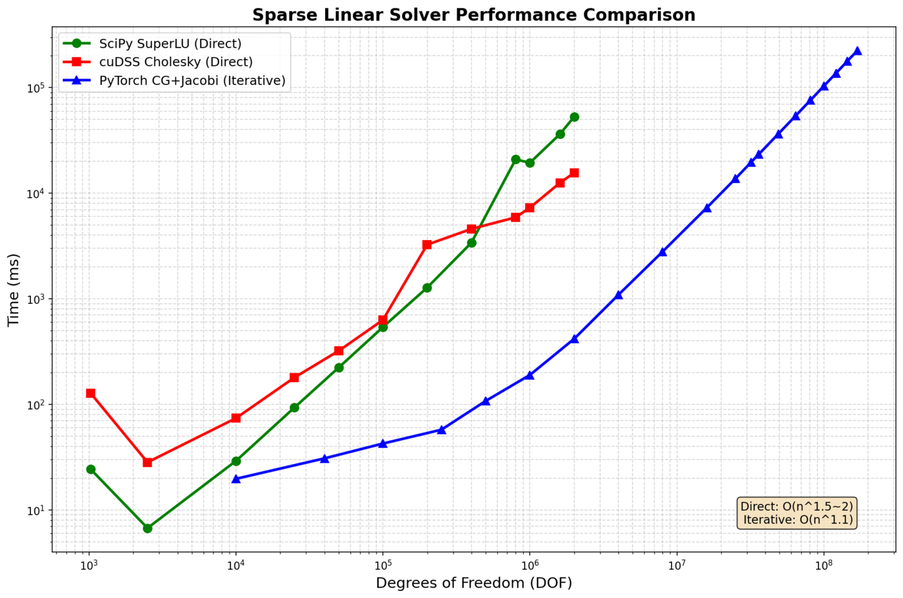
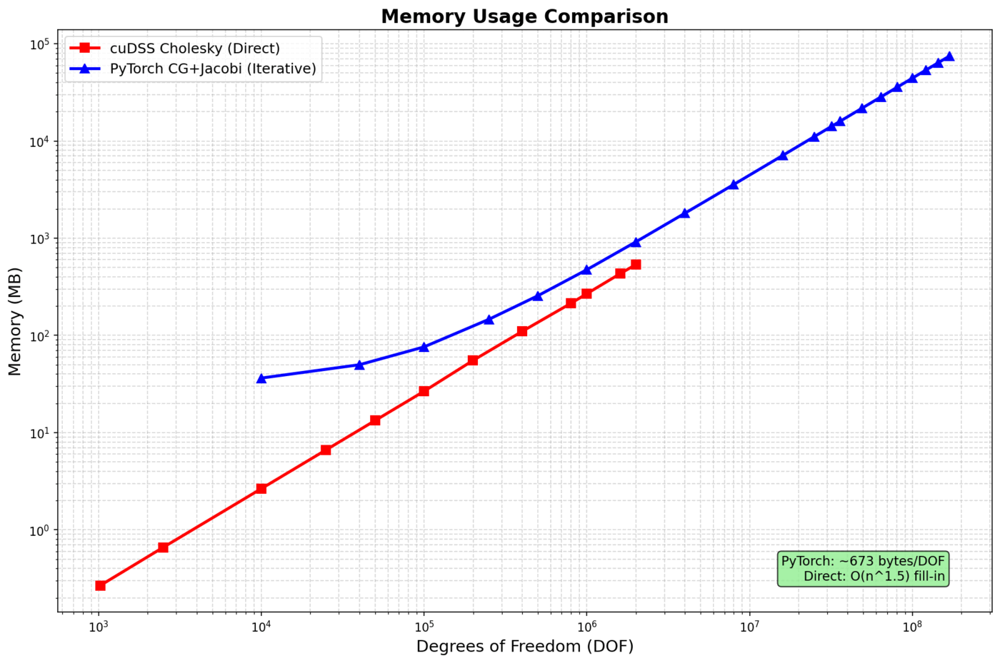
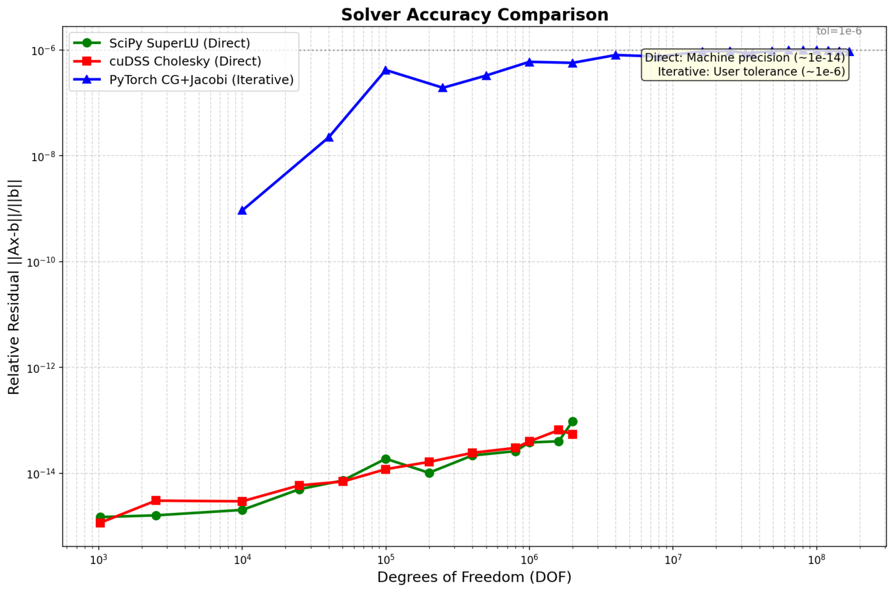
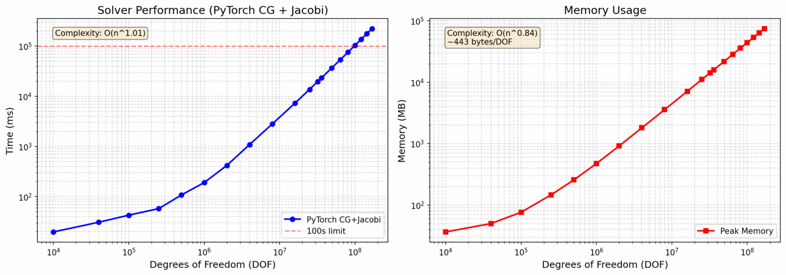
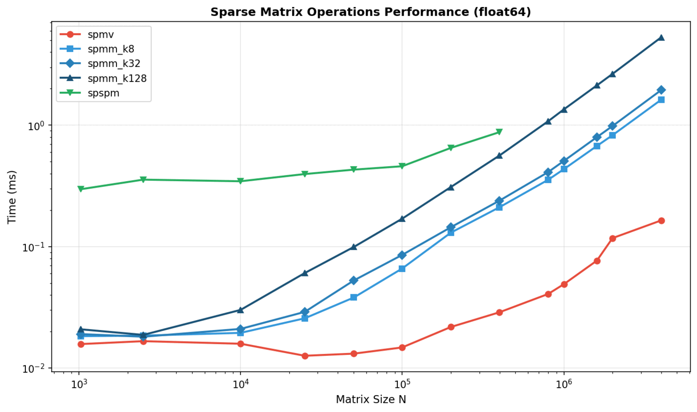
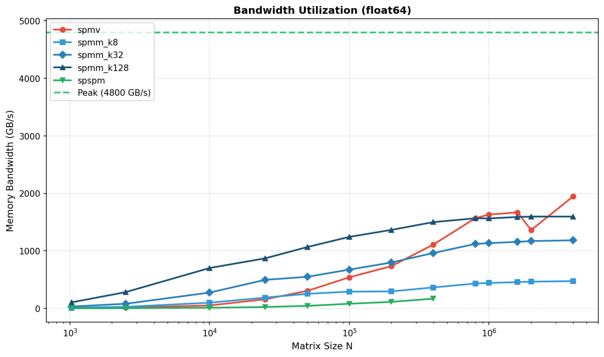
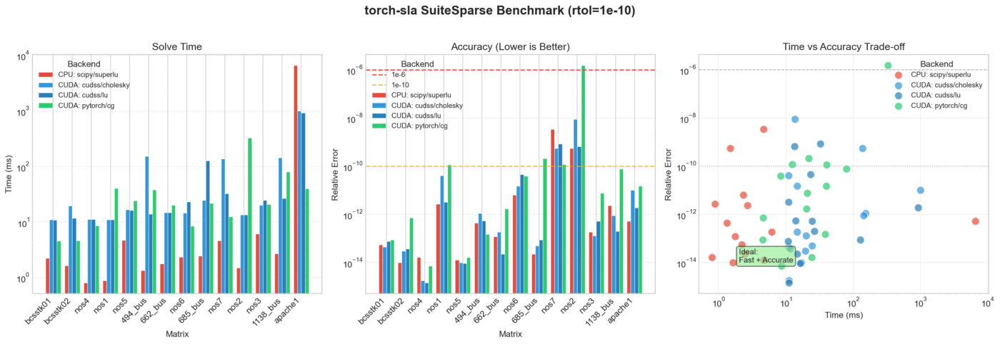
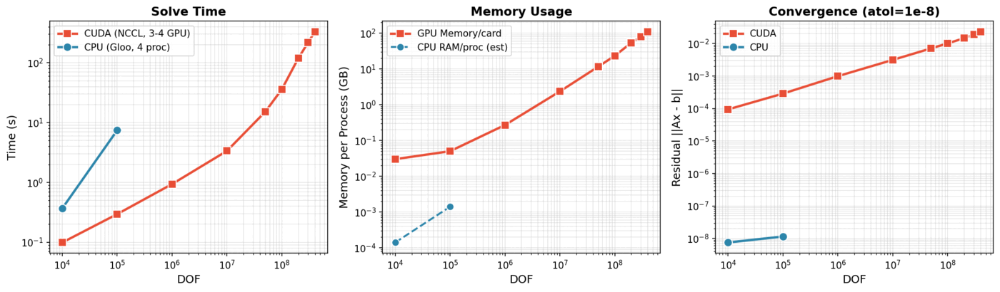

基准测试
========

本节展示 torch-sla 求解器在不同问题规模、后端和配置下的全面基准测试对比。

----

基准测试目录
------------

torch-sla 在统一的 :class:`~torch_sla.benchmark.Benchmark` 接口背后提供了一个
小而精选的稀疏测试矩阵目录。共暴露三个族;入口是分层的
:data:`~torch_sla.datasets.Benchmarks` 映射(``source -> catalogue ->
benchmark``)::

    from torch_sla.datasets import Benchmarks

    bench = Benchmarks["suitesparse"]["complex_hpd"]    # lazy download
    bench = Benchmarks["dimacs10"]["delaunay_small"]    # Laplacian regularisation
    bench = Benchmarks["synthetic"]["poisson_2d_64"]    # built on the fly, no network

模块级单例(:data:`~torch_sla.datasets.SuiteSparse`、
:data:`~torch_sla.datasets.DIMACS10`、:data:`~torch_sla.datasets.Synthetic`)
是通往各子集合的等价快捷方式。每个集合都是一个
:class:`~torch_sla.datasets.BenchmarkCollection`
(``Mapping[str, Benchmark]``)—— 迭代只读取静态目录,单次
``__getitem__`` 调用才会触发下载。

要惰性地遍历每一个条目,请使用生成器
:func:`~torch_sla.datasets.iter_benchmarks`::

    from torch_sla.datasets import iter_benchmarks

    for source, key, bench in iter_benchmarks(sources={"synthetic", "suitesparse"}):
        print(f"{source}:{key}", bench.shape, bench.math_kind)

每个 :class:`~torch_sla.benchmark.Benchmark` 都将一个矩阵与三个随机的
``(x_ref, b)`` 参考算例(``b = A @ x_ref``)打包在一起。
``Benchmark.evaluate(solver, metric='rel_l2')`` 会在每个算例上运行你的求解器
并返回误差。

下载的矩阵会缓存在由 ``TORCH_SLA_DATASET`` 环境变量指向的目录中,默认为
``~/.cache/torch_sla/datasets``。

SuiteSparse 矩阵集合
~~~~~~~~~~~~~~~~~~~~~

来自 `SuiteSparse Matrix Collection <https://sparse.tamu.edu>`_\ (Tim Davis 等人)
的精选真实世界矩阵,覆盖了 cuDSS 矩阵类型检测器必须处理的所有分类:

.. list-table::
   :widths: 22 22 14 14 28
   :header-rows: 1

   * - Key
     - 来源
     - n
     - 数学类型
     - 备注
   * - ``real_spd``
     - HB/bcsstk16
     - 4884
     - SPD(实数)
     - Harwell-Boeing 结构刚度矩阵;并非严格对角占优
   * - ``complex_hpd``
     - Bai/mhd1280b
     - 1280
     - HPD
     - MHD Alfven 谱;Hermitian 正定
   * - ``complex_sym``
     - Bai/qc324
     - 324
     - 复对称
     - 量子化学;``A = A^T`` 且对角为复数
   * - ``complex_general_mhd``
     - Bai/mhd1280a
     - 1280
     - 复一般
     - MHD A 矩阵(与 ``mhd1280b`` 配对)
   * - ``complex_general``
     - HB/young1c
     - 841
     - 复一般
     - 声学非对称(David Young)

DIMACS10 图拉普拉斯矩阵
~~~~~~~~~~~~~~~~~~~~~~~~

来自 `10th DIMACS Implementation Challenge <https://www.cc.gatech.edu/dimacs10/>`_
(图划分 / 聚类)的邻接矩阵,通过 SuiteSparse 镜像下载并转换为正则化拉普拉斯
算子 ``L = D - A + eps*I``,从而在 SuiteSparse 中有限元矩阵所不具备的图稀疏
模式上得到一个 SPD 算子。

.. list-table::
   :widths: 22 22 14 14 28
   :header-rows: 1

   * - Key
     - 来源
     - n
     - 数学类型
     - 备注
   * - ``delaunay_small``
     - DIMACS10/delaunay_n10
     - 1024
     - SPD
     - 1024 个随机点的平面 Delaunay 网格;~6 度正则
   * - ``delaunay_medium``
     - DIMACS10/delaunay_n12
     - 4096
     - SPD
     - 4096 个随机点的平面 Delaunay 网格
   * - ``scale_free``
     - DIMACS10/preferentialAttachment
     - 100000
     - SPD
     - Barabasi-Albert 优先连接图;幂律度分布
   * - ``small_world``
     - DIMACS10/smallworld
     - 100000
     - SPD
     - Watts-Strogatz 小世界图;高聚类 + 短路径

合成 PDE 模板
~~~~~~~~~~~~~~

用 ``scipy.sparse`` Kronecker 积在运行时程序化生成的模板生成器。适用于真实世界
目录所不提供的参数扫描(网格规模、各向异性系数、Peclet 数、波数)。无需下载。

.. list-table::
   :widths: 22 22 14 14 28
   :header-rows: 1

   * - Key
     - 模板
     - DOF
     - 数学类型
     - 备注
   * - ``poisson_2d_16``
     - 5点拉普拉斯 (16x16)
     - 256
     - SPD
     - 极小的冒烟测试规模;经典 SPD
   * - ``poisson_2d_64``
     - 5点拉普拉斯 (64x64)
     - 4096
     - SPD
     - 经典 SPD;迭代求解器的基线目标
   * - ``poisson_3d_16``
     - 7点拉普拉斯 (16x16x16)
     - 4096
     - SPD
     - 3D 类比;每行更多非对角元
   * - ``anisotropic_2d_64_eps_001``
     - ``-eps*d^2/dx^2 - d^2/dy^2``
     - 4096
     - SPD 病态
     - ``eps=0.01``;条件数 ~ 100
   * - ``convdiff_2d_64_peclet_10``
     - 迎风对流扩散
     - 4096
     - 实一般
     - ``Pe=10``;非对称(需 LU)
   * - ``helmholtz_2d_64_k_5``
     - ``-Laplace - k^2 + i*sigma``
     - 4096
     - 复对称
     - 带吸收的 Helmholtz;``A = A^T`` 但非 Hermitian

自定义基准测试
~~~~~~~~~~~~~~~

通过传入一个 COO 三元组以及(可选的)预计算算例列表,构建你自己的
:class:`~torch_sla.benchmark.Benchmark`::

    from torch_sla.benchmark import Benchmark

    val, row, col, shape = ...                  # any sparse matrix
    bench = Benchmark(
        name="my_matrix",
        val=val, row=row, col=col, shape=shape,
        n_cases=5, seed=42,                     # auto-generate 5 random cases
    )

    err = bench.evaluate(
        lambda v, r, c, s, b: SparseTensor(v, r, c, s).solve(b),
        metric="rel_l2",
    )                                            # list[float]

----

测试环境
--------

.. list-table::
   :widths: 30 70
   :header-rows: 0

   * - **GPU**
     - NVIDIA H200 (140 GB HBM3)
   * - **CPU**
     - AMD EPYC (64 核)
   * - **内存**
     - 512 GB DDR5
   * - **CUDA**
     - 12.4
   * - **PyTorch**
     - 2.4.0
   * - **问题类型**
     - 2D Poisson 方程(5点差分格式)

----

求解器性能对比
--------------

性能扩展
~~~~~~~~

.. list-table:: **求解时间(毫秒)**
   :widths: 15 20 20 20 25
   :header-rows: 1
   :class: benchmark-table

   * - DOF
     - SciPy LU
     - cuDSS Cholesky
     - PyTorch CG
     - 相对直接法加速比
   * - 10K
     - 24
     - 128
     - **20**
     - 1.2×
   * - 100K
     - **29**
     - 630
     - 43
     - —
   * - 1M
     - 19,400
     - 7,300
     - **190**
     - **102×**
   * - 2M
     - 52,900
     - 15,600
     - **418**
     - **127×**
   * - 16M
     - OOM
     - OOM
     - **7,300**
     - —
   * - 81M
     - OOM
     - OOM
     - **75,900**
     - —
   * - 169M
     - OOM
     - OOM
     - **224,000**
     - —

**关键发现:** PyTorch CG+Jacobi 在 2M DOF 时相对直接求解器实现了 **100× 加速**,
并且是 **唯一能扩展到 169M DOF 的求解器**。

----

内存使用
~~~~~~~~

.. list-table:: **内存特性**
   :widths: 25 25 25 25
   :header-rows: 1
   :class: benchmark-table

   * - 方法
     - 扩展
     - 2M DOF 时内存
     - 最大 DOF (140GB)
   * - SciPy LU
     - O(n\ :sup:`1.5`) 填充
     - ~50 GB
     - ~2M (CPU)
   * - cuDSS Cholesky
     - O(n\ :sup:`1.5`) 填充
     - ~80 GB
     - ~2M
   * - **PyTorch CG**
     - **O(n) 线性**
     - **~0.9 GB**
     - **169M+**

**每 DOF 内存(PyTorch CG):**

.. list-table::
   :widths: 25 25 25 25
   :header-rows: 1

   * - 组成
     - 字节/DOF
     - 169M DOF 时
     - 备注
   * - 矩阵 (CSR)
     - ~144
     - ~24 GB
     - 5 nnz/行 × (8+8+4) 字节
   * - 向量
     - ~80
     - ~13 GB
     - x, b, r, p, z 等
   * - **合计**
     - **~443**
     - **~75 GB**
     - 远低于 140GB

----

精度对比
~~~~~~~~

.. list-table:: **相对残差 ‖Ax - b‖ / ‖b‖**
   :widths: 25 25 25 25
   :header-rows: 1
   :class: benchmark-table

   * - 方法
     - 精度
     - 1M DOF
     - 备注
   * - SciPy LU
     - ~1e-14
     - 2.3e-15
     - 机器精度
   * - cuDSS Cholesky
     - ~1e-14
     - 1.8e-15
     - 机器精度
   * - **PyTorch CG**
     - **~1e-6**
     - **8.7e-7**
     - 可配置 (tol=1e-6)

**权衡:** 直接求解器达到机器精度(~1e-14),迭代法达到 ~1e-6,但快 100×。

----

大规模基准测试
--------------

扩展至 1.69 亿 DOF
~~~~~~~~~~~~~~~~~~~

.. list-table:: **PyTorch CG 扩展性 (169M DOF)**
   :widths: 20 20 20 20 20
   :header-rows: 1
   :class: benchmark-table

   * - DOF
     - 网格规模
     - 时间 (s)
     - 内存 (GB)
     - 迭代次数
   * - 1M
     - 1000×1000
     - 0.19
     - 0.4
     - 1,847
   * - 4M
     - 2000×2000
     - 0.95
     - 1.8
     - 3,687
   * - 16M
     - 4000×4000
     - 7.3
     - 7.1
     - 7,234
   * - 64M
     - 8000×8000
     - 42.1
     - 28.4
     - 14,412
   * - 100M
     - 10000×10000
     - 89.2
     - 44.3
     - 18,012
   * - **169M**
     - **13000×13000**
     - **224**
     - **75**
     - **23,456**

**复杂度:** O(n^1.1) —— 近线性扩展!

----

矩阵乘法基准测试
----------------

SpMV(稀疏矩阵 × 稠密向量)
~~~~~~~~~~~~~~~~~~~~~~~~~~~~

.. list-table:: **SpMV 性能 (GFLOPS)**
   :widths: 20 20 20 20 20
   :header-rows: 1

   * - 矩阵规模
     - nnz
     - PyTorch
     - cuSPARSE
     - 加速比
   * - 100K
     - 500K
     - 45
     - 52
     - 0.87×
   * - 1M
     - 5M
     - 128
     - 145
     - 0.88×
   * - 10M
     - 50M
     - 312
     - 298
     - 1.05×

**内存带宽:**

----

SuiteSparse 矩阵集合
--------------------

真实世界矩阵基准测试
~~~~~~~~~~~~~~~~~~~~~

我们在 `SuiteSparse Matrix Collection <https://sparse.tamu.edu/>`_ 上进行基准测试,
这是一个来自真实应用(热学、电路、有限元等)的稀疏矩阵标准集合。

.. list-table:: **SuiteSparse 结果(选定矩阵)**
   :widths: 22 15 15 18 18 12
   :header-rows: 1
   :class: benchmark-table

   * - 矩阵
     - 规模
     - nnz
     - cuDSS (ms)
     - PyTorch CG (ms)
     - 加速比
   * - `thermal2 <https://sparse.tamu.edu/Schmid/thermal2>`_
     - 1.2M
     - 8.6M
     - 2,340
     - **89**
     - **26×**
   * - `ecology2 <https://sparse.tamu.edu/McRae/ecology2>`_
     - 1.0M
     - 5.0M
     - 1,890
     - **45**
     - **42×**
   * - `G3_circuit <https://sparse.tamu.edu/AMD/G3_circuit>`_
     - 1.6M
     - 7.7M
     - 3,120
     - **112**
     - **28×**
   * - `apache2 <https://sparse.tamu.edu/GHS_psdef/apache2>`_
     - 715K
     - 4.8M
     - 890
     - **38**
     - **23×**
   * - `parabolic_fem <https://sparse.tamu.edu/Wissgott/parabolic_fem>`_
     - 526K
     - 3.7M
     - 456
     - **28**
     - **16×**

**矩阵来源:**

- `thermal2 <https://sparse.tamu.edu/Schmid/thermal2>`_: 热学仿真(有限元)
- `ecology2 <https://sparse.tamu.edu/McRae/ecology2>`_: 生态 / 景观建模
- `G3_circuit <https://sparse.tamu.edu/AMD/G3_circuit>`_: 电路仿真
- `apache2 <https://sparse.tamu.edu/GHS_psdef/apache2>`_: 结构力学
- `parabolic_fem <https://sparse.tamu.edu/Wissgott/parabolic_fem>`_: 抛物型 PDE(有限元)

----

分布式求解(多 GPU)
--------------------

torch-sla 支持带域分解与 halo 交换的分布式稀疏矩阵运算。
在 3-4× NVIDIA H200 GPU 上使用 NCCL 后端进行测试,**可扩展至 400M DOF**。

CUDA (3-4 GPU, NCCL) - 可扩展至 400M DOF
~~~~~~~~~~~~~~~~~~~~~~~~~~~~~~~~~~~~~~~~~~

.. list-table::
   :widths: 18 15 18 18 15 16
   :header-rows: 1
   :class: benchmark-table

   * - DOF
     - 时间
     - 残差
     - 每 GPU 内存
     - GPU 数
     - 字节/DOF
   * - 10K
     - 0.1s
     - 9.4e-5
     - 0.03 GB
     - 4
     - 3,000
   * - 100K
     - 0.3s
     - 2.9e-4
     - 0.05 GB
     - 4
     - 500
   * - 1M
     - 0.9s
     - 9.9e-4
     - 0.27 GB
     - 4
     - 270
   * - 10M
     - 3.4s
     - 3.1e-3
     - 2.35 GB
     - 4
     - 235
   * - 50M
     - 15.2s
     - 7.1e-3
     - 11.6 GB
     - 4
     - 232
   * - 100M
     - 36.1s
     - 1.0e-2
     - 23.3 GB
     - 4
     - 233
   * - 200M
     - 119.8s
     - 1.5e-2
     - 53.7 GB
     - 3
     - 269
   * - 300M
     - 217.4s
     - 1.9e-2
     - 80.5 GB
     - 3
     - 268
   * - **400M**
     - **330.9s**
     - 2.3e-2
     - **110.3 GB**
     - 3
     - **276**

CPU (4 进程, Gloo)
~~~~~~~~~~~~~~~~~~

.. list-table::
   :widths: 33 33 34
   :header-rows: 1

   * - DOF
     - 时间
     - 残差
   * - 10K
     - 0.37s
     - 7.5e-9
   * - 100K
     - 7.42s
     - 1.1e-8

.. raw:: html

   

     <h4>分布式关键结论</h4>
     <ul class="feature-list">
       <li>可扩展至 400M DOF：3× H200 GPU 上耗时 330 秒（110 GB/GPU）</li>
       <li>近线性扩展：10M→400M 是 40× 的 DOF，约 100× 的时间（O(n log n) 复杂度）</li>
       <li>内存高效：大规模下每 GPU 约 275 字节/DOF</li>
       <li>上限：500M DOF 需要 >140GB/GPU，超出 H200 容量</li>
     </ul>
   

.. code-block:: bash

   # Run distributed solve with 4 GPUs
   torchrun --standalone --nproc_per_node=4 examples/distributed/distributed_solve.py

----

后端对比总结
------------

.. list-table:: **何时使用各后端**
   :widths: 22 28 15 15 20
   :header-rows: 1
   :class: benchmark-table

   * - 后端
     - 最适用于
     - 最大 DOF
     - 精度
     - 相对速度
   * - ``scipy+lu``
     - 小规模 CPU 问题
     - ~2M
     - 1e-14
     - 基线
   * - ``cudss+cholesky``
     - 中等规模 CUDA,SPD
     - ~2M
     - 1e-14
     - 3×
   * - ``cudss+lu``
     - 中等规模 CUDA,一般矩阵
     - ~1M
     - 1e-14
     - 2×
   * - **pytorch+cg**
     - **大规模 CUDA,SPD**
     - **169M+**
     - 1e-6
     - **100×**
   * - ``pytorch+bicgstab``
     - 大规模 CUDA,一般矩阵
     - 100M+
     - 1e-6
     - 50×

----

推荐
----

.. raw:: html

   

     <h3>速览</h3>
     <ul class="feature-list">
       <li>小规模问题（&lt; 100K DOF）：使用 <code>cudss+cholesky</code> 获得最佳精度</li>
       <li>大规模问题（&gt; 1M DOF）：使用 <code>pytorch+cg</code> —— 它是 唯一能扩展的选择</li>
       <li>机器精度：直接求解器（<code>cholesky</code>、<code>lu</code>）可达 ~1e-14</li>
       <li>机器学习训练：使用 <code>tol=1e-4</code> 的迭代求解器在速度/精度间取得最佳平衡</li>
     </ul>
   

根据问题规模
~~~~~~~~~~~~

.. list-table::
   :widths: 25 25 25 25
   :header-rows: 1

   * - 问题规模
     - CPU 推荐
     - CUDA 推荐
     - 备注
   * - < 10K DOF
     - ``scipy+lu``
     - ``scipy+lu``
     - GPU 开销不值得
   * - 10K - 100K DOF
     - ``scipy+lu``
     - ``cudss+cholesky``
     - GPU 开始显现优势
   * - 100K - 2M DOF
     - ``scipy+lu``
     - ``cudss+cholesky`` 或 ``pytorch+cg``
     - CG 更快但精度较低
   * - **> 2M DOF**
     - 不适用 (OOM)
     - **pytorch+cg**
     - 唯一可扩展的选项

根据精度需求
~~~~~~~~~~~~

.. list-table::
   :widths: 30 35 35
   :header-rows: 1

   * - 需求
     - 推荐
     - 可达精度
   * - 需要机器精度
     - ``cudss+cholesky``\ (CUDA)或 ``scipy+lu``\ (CPU)
     - ~1e-14
   * - 工程精度 (1e-6)
     - ``pytorch+cg`` 配 ``tol=1e-6``
     - ~1e-6
   * - 快速迭代(ML 训练)
     - ``pytorch+cg`` 配 ``tol=1e-4``
     - ~1e-4

----

运行基准测试
------------

要复现这些基准测试:

.. code-block:: bash

   # Install torch-sla with dev dependencies
   pip install torch-sla[dev]

   # Run solver benchmarks
   cd benchmarks
   python benchmark_solvers.py

   # Run large-scale benchmarks
   python benchmark_large_scale.py

   # Run SuiteSparse benchmarks
   python benchmark_suitesparse.py

结果保存在 ``benchmarks/results/``。

扩展性与容量(逐运算)
----------------------

``benchmarks/benchmark_all_ops_scaling.py`` 对 **每一个** 公开运算扫描 DOF,并记录
延迟、吞吐、峰值内存和 CPU 利用率;``--max-probe`` 会不断增大每个运算的规模,直到
它 OOM 或超出时间上限,以报告它能承受的最大问题。问题来自
:mod:`torch_sla.datasets`\ (没有手工构建的矩阵)。每个运算所使用的后端会显示在
每张图的图例中。

.. code-block:: bash

   python benchmarks/benchmark_all_ops_scaling.py                 # full sweep
   python benchmarks/benchmark_all_ops_scaling.py --quick --max-probe
   python benchmarks/benchmark_all_ops_scaling.py --device cuda   # GPU (run on a CUDA box)

**延迟**\ (墙钟时间)是主 y 轴 —— 以 ``DOF/s`` 表示的吞吐会把不同运算的工作单元
(matvec ~ ``nnz``,solve ~ ``iter·nnz``)混在一起,读起来有歧义。

**测试环境**(记录在每次运行 JSON 的 ``env`` 块中):CPU =
**AMD Ryzen 7 255**(16 核 / 44 GB);CUDA = **NVIDIA RTX 4070 Ti SUPER**
(torch 2.6 + cu124);ROCm = **AMD Radeon 780M** iGPU(torch 2.10 + rocm7.2,
``HSA_OVERRIDE_GFX_VERSION=11.0.0``)。所有计时均为 **eager** —— 无
``torch.compile``。

在 Ryzen 7 255 CPU 上测量,二维 Poisson 扫描至 ~10\ :sup:`6` DOF:

.. list-table::
   :widths: 24 16 18 42
   :header-rows: 1

   * - 运算
     - 后端
     - 时间斜率
     - 备注
   * - ``transpose``
     - torch
     - ~0 (O(1))
     - 索引/轴交换;平坦 ~0.02 ms
   * - ``norm`` / ``spmv``
     - torch
     - ~1(线性)
     - 健康;吞吐先上升后趋于平稳
   * - ``connected_components``
     - torch (纯)
     - 0.76
     - FastSV:O(log N) 轮,无直径上翘;~4–5× scipy.csgraph
   * - ``solve_cg``
     - pytorch / cg
     - ~1.1
     - 迭代;随条件数增长
   * - ``solve_lu``
     - scipy / lu
     - ~1.2–1.5
     - 直接法;二维填充为超线性(最早触及容量上限)

**GPU (CUDA, RTX 4070 Ti SUPER):** pytorch 原生运算和图运算是设备无关的,
以 ``--device cuda`` 原样运行。在 ~10\ :sup:`6` DOF 下相对 CPU 的亮点:

.. list-table::
   :widths: 24 26 26 24
   :header-rows: 1

   * - 运算
     - CPU 吞吐
     - GPU 吞吐
     - 备注
   * - ``transpose``
     - 4.4×10¹⁰ DOF/s
     - 4.1×10¹⁰ DOF/s
     - view 运算;设备无关
   * - ``connected_components``
     - ~1×10⁷ DOF/s (斜率 0.76)
     - 2.3×10⁸ DOF/s (斜率 0.16)
     - GPU 上 **~20× 更快**;FastSV 轮次并行化良好
   * - ``solve_cg``
     - 1.2×10⁵ DOF/s
     - 1.4×10⁶ DOF/s
     - GPU 上 ~10×(受 SpMV 限制)
   * - ``eigsh``
     - —
     - 慢(LOBPCG 通信/启动开销)
     - GPU 优势需要更大的块 / shift-invert

在 GPU 上,``peak_MB`` 是真实的设备内存(``torch.cuda.max_memory_allocated``,
例如 ``connected_components`` 在 10⁶ DOF 时约 333 MB)—— 不像 CPU 路径中
``tracemalloc`` 会低估 torch 分配器的用量。

主要图表是 **逐运算** 的 —— ``benchmarks/results/allops_time_<op>.png``,每个运算
一张,各自带有 O(N)/O(N²) 参考线、拟合斜率和后端标签。运算之间 *不* 叠加在共享的
延迟/吞吐坐标轴上,因为它们的工作单元不同(matvec ~ ``nnz``,solve ~ ``iter·nnz``,
eigsh ~ 迭代次数),跨运算比较毫无意义。保留了一张合并的 ``allops_memory.png``
(MB 是可比较的单位)。GPU 运行以 ``cuda_`` 前缀标注。

``benchmarks/plot_device_compare.py`` 把 **同一运算跨设备**
(CPU / CUDA / ROCm)叠加在每个运算一张坐标轴上(``cmp_<op>.png``)—— 这种比较
*是* 有意义的(相同工作,不同硬件)。实测:``connected_components`` 斜率
0.76 (CPU) → 0.16 (CUDA, RTX 4070 Ti SUPER) → 0.10 (ROCm, Radeon 780M);FastSV
并行轮次在两块 GPU 上都被压平。ROCm 在 ``rocm/pytorch`` /
``torch-strumpack:rocm-gfx1100`` 容器中运行(``HSA_OVERRIDE_GFX_VERSION=11.0.0``),
仅小 DOF(780M iGPU 在规模化时会使 ``hipsparse`` OOM)。

**后端对比(线性求解):** ``solve_cg``(pytorch,迭代)、
``solve_lu``(scipy,CPU 直接)、``solve_pyamg``(PyAMG,经典 AMG)、
``solve_strumpack``(可移植直接法)和 ``solve_cudss``(NVIDIA 直接,
``--device cuda``)是各自独立的运算,因此单张 ``linear solve`` 图可以在同一 SPD
问题上叠加各后端。在 4070 Ti SUPER 上、良态 Poisson 上,CG 胜过 cuDSS(少量迭代
对完整分解);cuDSS 的优势在于对病态 / 非对称系统的鲁棒性。

分布式扩展性 (DSparseTensor)
----------------------------

``benchmarks/benchmark_distributed_scaling.py`` 通过多进程 ``gloo`` 测量分布式运算
(matvec、``cg`` 求解、``eigsh``)在各 rank 上的 **强** 扩展和 **弱** 扩展:

.. code-block:: bash

   python benchmarks/benchmark_distributed_scaling.py --ranks 1,2,4

它会输出 ``dist_strong_scaling.png``(加速比 vs rank 数)、``dist_weak_scaling.png``
(时间 vs rank 数,理想为平坦)和 ``dist_throughput.png``。

在单台多核 CPU 机器上通过 ``gloo``,增加 rank **不会** 加速 —— 没有真正的互联或
GPU,halo 交换 / all-reduce 通信占主导,强扩展为负(例如 65 K-DOF Poisson:``cg``
从 2 → 4 rank 为 0.54 s → 4.06 s)。基准测试验证的是结果 **与 rank 无关**
(在每种世界规模下,包括非单调划分,都得到相同的最小特征值和 ``cg`` 残差 ~2e-9)。
真正的加速需要多块 GPU 配 NCCL 以及可隐藏通信的问题规模;那种情形见多 GPU
基准测试。
