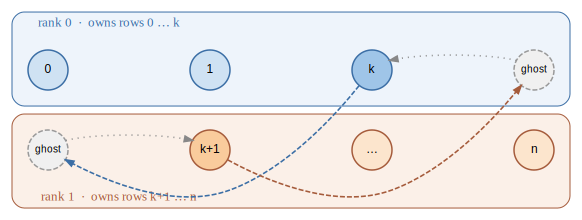

DSparseTensor
=============

:class:`~torch_sla.DSparseTensor` 是 :class:`~torch_sla.SparseTensor` 的分布式
对应物。它用域分解把一个稀疏矩阵的行分到一个 ``DeviceMesh`` 的各个 rank 上:
每个 rank 拥有一个连续的行块,以及一圈 halo 即“幽灵列”(被本 rank 的行引用、
但实际归属于别处)。向量保持在 rank 本地;唯一的通信是每次矩阵—向量乘积前的
一次 halo 交换,以及 Krylov 迭代内部用于内积的一次 all-reduce。这个包装类
镜像 ``torch.distributed.tensor.DTensor``,并在 rank 本地复用单进程运算,因此
运算词汇表与 :doc:`sparse_tensor` 一致。

分区
----

一个分布式张量由一个全局 :class:`~torch_sla.SparseTensor` 和一个 mesh 构建。
三个入口覆盖了常见布局:

.. code-block:: python

   from torch.distributed.device_mesh import init_device_mesh
   from torch_sla import SparseTensor, DSparseTensor

   mesh = init_device_mesh("cpu", (world_size,))
   A = SparseTensor(val, row, col, (n, n))

   # Row-partition a single matrix across the mesh (RowPartitioned placement)
   D = DSparseTensor.partition(A, mesh, partition_method="metis")

   # Partition a batch of same-pattern matrices, one shard per rank (BatchShard)
   D = DSparseTensor.partition_batch(A_batched, mesh)

   # Re-wrap shards that were already produced per-rank (no re-partitioning)
   D = DSparseTensor.from_global_distributed(local_shard, spec, mesh)

``partition_method`` 选择如何分配行:``"simple"``(连续块)、``"metis"``
(图分区,最小化 halo)或 ``"coordinates"``(基于几何,需要 ``coords``)。
owned/halo 的簿记只计算一次并缓存在 placement 上。

Scatter / gather 在全局向量与分片布局之间来回搬运:

.. code-block:: python

   d = D.scatter(global_vec)     # global torch.Tensor -> DTensor[Shard(0)]
   y = (D @ d).full_tensor()     # gather a sharded result back to global

分布式求解与语法糖 API
----------------------

``*_shard`` 方法是底层原语:它们完全在 Shard(0) 空间中运作(每个向量按 rank
所拥有的行定大小),用 halo 交换 SpMV 加上 all-reduce 点积驱动 Krylov 迭代。
在它们之上是一层薄薄的语法糖,其名字和签名都与
:class:`~torch_sla.SparseTensor` 一致,因此单进程代码只需极少改动就能移植:

.. list-table::
   :widths: 30 35 35
   :header-rows: 1

   * - 语法糖方法
     - 委托给
     - 对应于
   * - :meth:`~torch_sla.DSparseTensor.solve`
     - ``solve_distributed_shard``
     - :meth:`SparseTensor.solve <torch_sla.SparseTensor.solve>`
   * - :meth:`~torch_sla.DSparseTensor.solve_batch`
     - ``solve_batch_shard``
     - :meth:`SparseTensor.solve_batch <torch_sla.SparseTensor.solve_batch>`
   * - :meth:`~torch_sla.DSparseTensor.nonlinear_solve`
     - ``nonlinear_solve_distributed_shard``
     - :meth:`SparseTensor.nonlinear_solve <torch_sla.SparseTensor.nonlinear_solve>`
   * - :meth:`~torch_sla.DSparseTensor.connected_components`
     - ``connected_components_shard``
     - :meth:`SparseTensor.connected_components <torch_sla.SparseTensor.connected_components>`
   * - :meth:`~torch_sla.DSparseTensor.lsqr` / :meth:`~torch_sla.DSparseTensor.lsmr`
     - ``lsqr_shard`` / ``lsmr_shard``
     - ``spsolve(method='lsqr'/'lsmr')``

每个分布式结果都是*与 rank 无关*的:无论 world size 或分区方法如何,都得到
相同的全局解、特征值或分量标注。

.. code-block:: python

   b = D.scatter(global_b)
   x = D.solve(b)                       # distributed CG, DTensor in / DTensor out
   x_global = x.full_tensor()           # gather to a single rank

.. seealso::

   :doc:`distributed_scaling` —— 如何用 ``torchrun`` 对分布式求解做弱 / 强 /
   吞吐量扩展性基准、各指标的含义,以及如何扩展它。脚本:
   ``benchmarks/distributed/scaling/distributed_solve_scaling.py``。

Halo 交换 SpMV
--------------

矩阵—向量乘积 ``D @ x``(以及每次求解内部的 matvec)是 kernel 执行期间各
rank 唯一进行通信的地方。相乘之前,每个 rank 通过一次点对点 halo 交换,用
邻居 rank 所拥有的值填满自己的 halo 项,然后在自己拥有的行上跑一次纯本地
SpMV。这使每个 rank 的内存和计算都正比于它在矩阵中所占的份额;见
:ref:`op-distributed-matvec`。

下图展示两个 rank。每个 rank 拥有一个连续行块(实心节点)。rank 0 拥有的某行
可能引用 rank 1 拥有的某列(反之亦然);那些跨 rank 的项就是 *halo* / *幽灵*
槽位(虚线)。虚线的跨 rank 箭头就是 halo 交换:每个 rank 把自己拥有的边界值
发出去,填满邻居的幽灵槽,之后两个 rank 都跑一次完全本地的 SpMV。

   Halo 交换。每个 rank 拥有一块连续的行；**虚线**箭头把边界行发到邻居的
   **ghost** 槽，**点线**箭头再把填好的 ghost 喂给该 rank 的本地 SpMV。
   只通信细薄的边界（halo），从不通信内部。

运算目录
--------

这些分布式运算会交叉引用它们在 :class:`~torch_sla.SparseTensor` 上的单进程
等价物。未列出的运算(``det``、``logdet``、``svd``、``condition_number``)会
在计算前汇聚到单个 rank,存在的目的是图方便,而非为了扩展性。

.. list-table::
   :widths: 26 26 48
   :header-rows: 1

   * - 运算
     - API
     - 单进程等价物
   * - :ref:`partition <op-partition>`
     - :meth:`~torch_sla.DSparseTensor.partition`
     - 从全局 :class:`~torch_sla.SparseTensor` 构造
   * - :ref:`solve <op-distributed-solve>`
     - :meth:`~torch_sla.DSparseTensor.solve`
     - :ref:`SparseTensor.solve <op-solve>`
   * - :ref:`solve_batch <op-solve-batch>`
     - :meth:`~torch_sla.DSparseTensor.solve_batch`
     - :ref:`SparseTensor.solve_batch <op-solve-batch>`
   * - :ref:`nonlinear_solve <op-nonlinear-solve>`
     - :meth:`~torch_sla.DSparseTensor.nonlinear_solve`
     - :ref:`SparseTensor.nonlinear_solve <op-nonlinear-solve>`
   * - :ref:`matvec / @ <op-distributed-matvec>`
     - :meth:`~torch_sla.DSparseTensor.__matmul__`
     - :ref:`SparseTensor.matvec <op-matvec>`
   * - :ref:`eigsh <op-distributed-eigsh>`
     - :meth:`~torch_sla.DSparseTensor.eigsh`
     - :ref:`SparseTensor.eigsh <op-eigsh>`
   * - :ref:`connected_components <op-distributed-cc>`
     - :meth:`~torch_sla.DSparseTensor.connected_components`
     - :ref:`SparseTensor.connected_components <op-connected-components>`
   * - :ref:`lsqr / lsmr <op-distributed-solve>`
     - :meth:`~torch_sla.DSparseTensor.lsqr`
     - ``spsolve(method='lsqr'/'lsmr')``

分片张量的保存 / 加载(每个分区一个文件)由
:meth:`~torch_sla.DSparseTensor.save` / :meth:`~torch_sla.DSparseTensor.load`
以及函数式的 :func:`~torch_sla.save_distributed` /
:func:`~torch_sla.load_partition` 处理。
