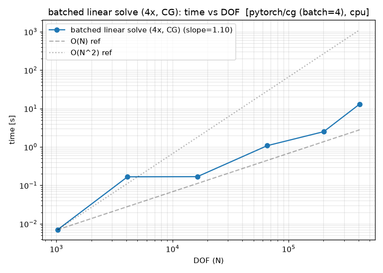
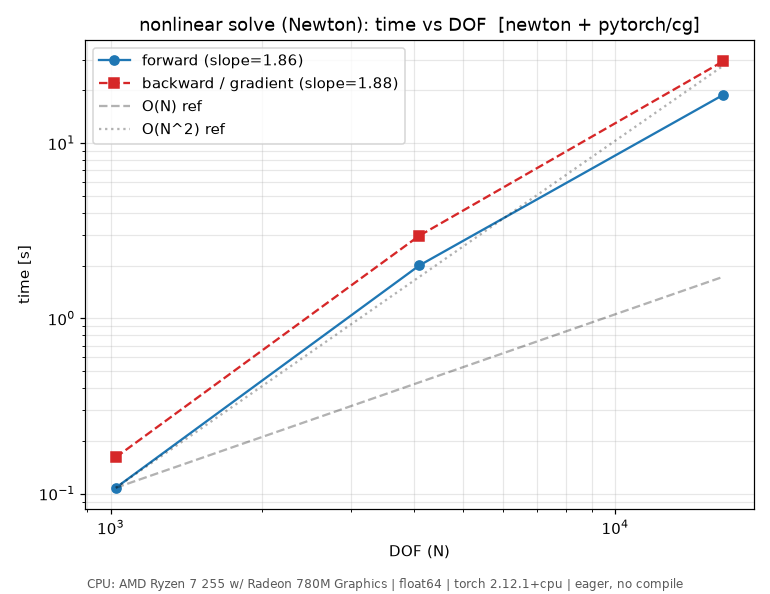
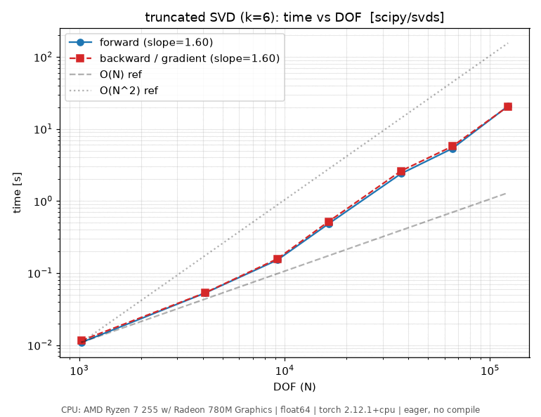
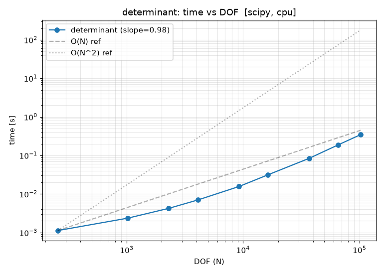
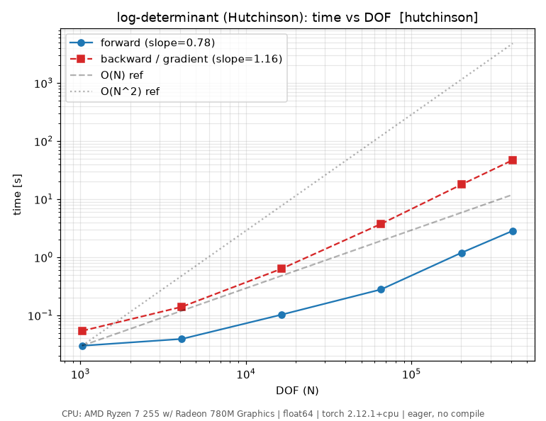
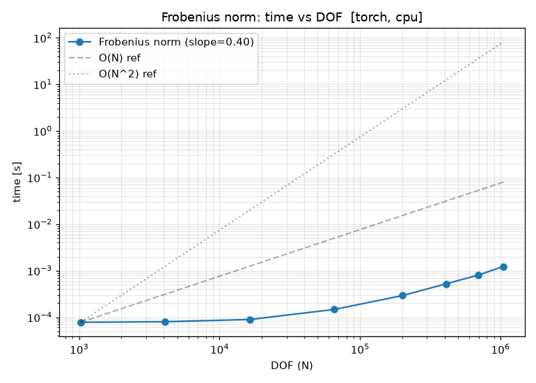
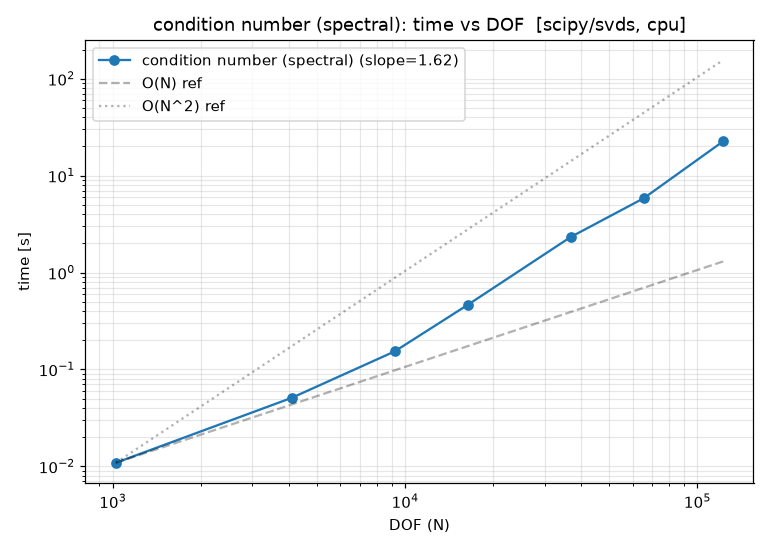

运算 (Operations)
=================

这是逐运算参考手册。运算按类别分组;每一条给出函数签名、一句话摘要、可运行
的示例、输入/输出可视化、它在哪些类上可用、API 链接,以及(在有测量数据时)
一张扩展性图。承载这些运算的两个类是 :class:`~torch_sla.SparseTensor`
(单进程,见 :doc:`sparse_tensor`)和 :class:`~torch_sla.DSparseTensor`
(分布式,见 :doc:`dsparse_tensor`)。

下文中,``A`` 是由二维 Poisson 模板构建的稀疏矩阵;它的稀疏模式如下:

.. figure:: ../../../assets/examples/spy_poisson_50x50.png
   :width: 50%
   :align: center

   50×50 网格(2,500 DOF)的 ``A.spy()`` —— 带状的五点模板。

扩展性图来自 ``benchmarks/benchmark_all_ops_scaling.py``(CPU = AMD
Ryzen 7 255;CUDA = RTX 4070 Ti SUPER)。完整方法学以及大规模单卡/多卡的
数据见 :doc:`benchmarks`。

----

线性求解
--------

.. _op-solve:

solve
~~~~~

``A.solve(b, *, backend='auto', method='auto', **kwargs) -> x``

求解 :math:`Ax = b` 得到 ``x``,根据设备和矩阵类型自动选择直接法
(LU/Cholesky)或迭代法(CG/BiCGStab/GMRES)后端。

**示例**

.. code-block:: python

   import torch
   from torch_sla import SparseTensor

   dense = torch.tensor([[ 4.0, -1.0,  0.0],
                         [-1.0,  4.0, -1.0],
                         [ 0.0, -1.0,  4.0]], dtype=torch.float64)
   A = SparseTensor.from_dense(dense)
   b = torch.tensor([1.0, 2.0, 3.0], dtype=torch.float64)

   x = A.solve(b)                      # auto: scipy+lu on CPU, cudss on GPU
   x = A.solve(b, backend='pytorch', method='cg', preconditioner='jacobi')

梯度通过伴随法(adjoint method)流经求解过程(O(1) 个计算图节点),既可以通过
在 values 上设置 ``requires_grad``,也可以通过函数式接口
:func:`~torch_sla.spsolve` 实现。

**输入 / 输出可视化**

``A.spy()`` 展示了算子;求解把右端项 ``b`` 映射到解 ``x = A⁻¹b``。对于一个
SPD 系统,CG 残差按下图衰减。

.. figure:: ../../../assets/examples/cg_convergence.png
   :width: 60%
   :align: center

   规模递增的二维 Poisson 系统的 CG 收敛过程。

**可用于** :class:`~torch_sla.SparseTensor`、
:class:`~torch_sla.DSparseTensor`(见 :ref:`op-distributed-solve`)。

**API** :meth:`~torch_sla.SparseTensor.solve`,函数式
:func:`~torch_sla.spsolve`。

**扩展性**

.. image:: ../../../assets/benchmarks/cg_scaling.png
   :alt: CG solve scaling
   :width: 80%
   :align: center

----

.. _op-solve-batch:

solve_batch
~~~~~~~~~~~

``A.solve_batch(val_batch, b_batch, **kwargs) -> x_batch``

求解一批共享同一稀疏模式、但取值和/或右端项不同的系统,复用同一次符号分解。

**示例**

.. code-block:: python

   from torch_sla import SparseTensor

   A = SparseTensor(val, row, col, shape)

   val_batch = torch.stack([val * (1.0 + 0.01 * t) for t in range(100)])  # [100, nnz]
   b_batch   = torch.randn(100, n, dtype=torch.float64)                   # [100, n]

   x_batch = A.solve_batch(val_batch, b_batch)                            # [100, n]

在张量本身带一个前导 batch 维度(形状 ``[B, n, n]``)时,通过 ``A.solve(b)``
也能以同样的方式工作。

**输入 / 输出可视化** 每个 batch 元素共享上面的 ``A.spy()`` 模式;元素之间只有
非零值不同。

**可用于** :class:`~torch_sla.SparseTensor`、
:class:`~torch_sla.DSparseTensor`(``BatchShard`` 布局)。

**API** :meth:`~torch_sla.SparseTensor.solve_batch`。

**扩展性**

----

.. _op-lu:

lu
~~

``A.lu(**kwargs) -> LUFactorization``

计算并缓存一个 LU 分解,使得对同一矩阵的重复求解可以跳过重新分解 ——
只做前代/回代。

**示例**

.. code-block:: python

   from torch_sla import SparseTensor

   A  = SparseTensor(val, row, col, shape)
   lu = A.lu()                          # factorize once: O(nnz^1.5)

   for t in range(100):                 # each solve is cheap: O(nnz)
       x_t = lu.solve(compute_rhs(t))

**输入 / 输出可视化** ``A.spy()`` 展示了算子;因子 ``L`` 和 ``U`` 保留它的
带状结构外加填充(fill-in)。

**可用于** :class:`~torch_sla.SparseTensor`。

**API** :meth:`~torch_sla.SparseTensor.lu`、:class:`~torch_sla.LUFactorization`。

**扩展性**

.. image:: ../../../assets/benchmarks/lu_scaling.png
   :alt: LU solve scaling
   :width: 80%
   :align: center

----

非线性
------

.. _op-nonlinear-solve:

nonlinear_solve
~~~~~~~~~~~~~~~

``A.nonlinear_solve(residual_fn, u0, *params, method='newton', **kwargs) -> u``

通过 Newton / Picard / Anderson 迭代求解 :math:`F(u, \theta) = 0`,并提供
对参数的伴随梯度(O(1) 个计算图节点,与迭代次数无关)。

**示例**

.. code-block:: python

   import torch
   from torch_sla import SparseTensor

   A = SparseTensor(val, row, col, (n, n))

   def residual(u, A, f):               # F(u) = A u + u^2 - f
       return A @ u + u**2 - f

   f  = torch.randn(n, requires_grad=True)
   u0 = torch.zeros(n)

   u = A.nonlinear_solve(residual, u0, f, method='newton')
   u.sum().backward()                   # f.grad via the adjoint method

**输入 / 输出可视化** ``A.spy()`` 展示了 Jacobian 的稀疏模式,Newton 每次
迭代都会复用它。

**可用于** :class:`~torch_sla.SparseTensor`、
:class:`~torch_sla.DSparseTensor`(Shard(0) Newton,需要 ``jac_diag_fn``)。

**API** :meth:`~torch_sla.SparseTensor.nonlinear_solve`,函数式
:func:`~torch_sla.nonlinear_solve`。

**扩展性**

----

特征值 / 谱
-----------

.. _op-eigsh:

eigsh / eigs
~~~~~~~~~~~~

``A.eigsh(k=6, which='LM', return_eigenvectors=True) -> (w, V)``

通过 LOBPCG/ARPACK 求对称/Hermitian 矩阵的前 k 个特征对
(:meth:`~torch_sla.SparseTensor.eigsh`);:meth:`~torch_sla.SparseTensor.eigs`
是其一般(非对称)版本。特征值是可微的。

**示例**

.. code-block:: python

   from torch_sla import SparseTensor

   A = SparseTensor(val, row, col, (n, n))

   w, V = A.eigsh(k=6, which='LM')      # 6 largest, symmetric
   w, V = A.eigsh(k=6, which='SM')      # 6 smallest
   w, V = A.eigs(k=6)                   # general matrix

   w = w.requires_grad_(); w.sum().backward()   # gradients flow to the values

**输入 / 输出可视化**

.. figure:: ../../../assets/examples/eigenvalue_spectrum.png
   :width: 60%
   :align: center

   一维 Laplacian(n=50)的特征值谱;由 ``eigsh(which='SM')`` 计算出的
   6 个最小特征值被高亮标出。

**可用于** :class:`~torch_sla.SparseTensor`、
:class:`~torch_sla.DSparseTensor`(见 :ref:`op-distributed-eigsh`)。

**API** :meth:`~torch_sla.SparseTensor.eigsh`、
:meth:`~torch_sla.SparseTensor.eigs`。

**扩展性**

.. image:: ../../../assets/benchmarks/eigsh_scaling.png
   :alt: eigsh scaling
   :width: 80%
   :align: center

----

.. _op-svd:

svd
~~~

``A.svd(k=6) -> (U, S, Vt)``

截断的秩-k 奇异值分解,:math:`A \approx U_k \Sigma_k V_k^T` —— 在 Frobenius
范数意义下的最优秩-k 近似。可微。

**示例**

.. code-block:: python

   from torch_sla import SparseTensor

   A = SparseTensor(val, row, col, (m, n))

   U, S, Vt = A.svd(k=10)
   A_approx = U @ torch.diag(S) @ Vt
   error = (A.to_dense() - A_approx).norm() / A.norm('fro')

**输入 / 输出可视化**

.. figure:: ../../../assets/examples/svd_lowrank.png
   :width: 70%
   :align: center

   左:奇异值谱(越过真实秩后快速衰减)。右:近似误差随保留秩的变化。

**可用于** :class:`~torch_sla.SparseTensor`。

**API** :meth:`~torch_sla.SparseTensor.svd`。

**扩展性**

----

矩阵—向量
---------

.. _op-matvec:

matvec / ``@`` (SpMV)
~~~~~~~~~~~~~~~~~~~~~

``A @ x -> y``  (稀疏矩阵—向量或矩阵—矩阵乘积)

稀疏矩阵—向量乘积 :math:`y = Ax`。``x`` 可以是一个向量、一摞向量,或另一个
:class:`~torch_sla.SparseTensor`(稀疏矩阵—矩阵乘)。它是每个迭代求解器的
骨干。

**示例**

.. code-block:: python

   from torch_sla import SparseTensor

   A = SparseTensor(val, row, col, (n, n))
   x = torch.randn(n, dtype=torch.float64)

   y = A @ x                            # SpMV
   Y = A @ torch.randn(n, 8)            # SpMM (8 right-hand sides)

**输入 / 输出可视化** ``A.spy()`` 展示了 ``x`` 的哪些元素对每个输出有贡献:
``y`` 的第 ``i`` 行对该行的非零元求和 ``A[i, j] * x[j]``。

**可用于** :class:`~torch_sla.SparseTensor`、
:class:`~torch_sla.DSparseTensor`(halo 交换 SpMV,见
:ref:`op-distributed-matvec`)。

**API** :meth:`~torch_sla.SparseTensor.__matmul__`。

**扩展性**

.. image:: ../../../assets/benchmarks/spmv_scaling.png
   :alt: SpMV scaling
   :width: 80%
   :align: center

----

标量 / 结构性
-------------

.. _op-det:

det
~~~

``A.det() -> torch.Tensor``

通过稀疏 LU 计算行列式(梯度由 Jacobi 公式经伴随法给出)。对 CUDA 张量优先
用 ``A.cpu().det()`` —— GPU 路径会稠密化。

**示例**

.. code-block:: python

   from torch_sla import SparseTensor

   dense = torch.tensor([[2.0, 1.0],
                         [1.0, 3.0]], dtype=torch.float64, requires_grad=True)
   A = SparseTensor.from_dense(dense)
   d = A.det()                          # 5.0
   d.backward()                         # dense.grad = [[3, -1], [-1, 2]]

**输入 / 输出可视化** ``A.spy()`` 展示了算子;行列式是它的一个标量概括。

**可用于** :class:`~torch_sla.SparseTensor`、
:class:`~torch_sla.DSparseTensor`(汇聚到单个 rank)。

**API** :meth:`~torch_sla.SparseTensor.det`。

**扩展性**

----

.. _op-logdet:

logdet
~~~~~~

``A.logdet() -> torch.Tensor``

对数行列式 —— 在 ``det`` 会溢出/下溢的场合数值更稳定。可微。

**示例**

.. code-block:: python

   from torch_sla import SparseTensor

   A  = SparseTensor(val, row, col, (n, n))
   ld = A.logdet()                      # log|det(A)|

**输入 / 输出可视化** 与 ``det`` 算子相同;见 ``A.spy()``。

**可用于** :class:`~torch_sla.SparseTensor`、
:class:`~torch_sla.DSparseTensor`(汇聚到单个 rank)。

**API** :meth:`~torch_sla.SparseTensor.logdet`。

**扩展性**

----

.. _op-norm:

norm
~~~~

``A.norm(ord='fro') -> torch.Tensor``

矩阵范数:Frobenius(默认)、1-范数或 2-范数。可微。

**示例**

.. code-block:: python

   from torch_sla import SparseTensor

   A = SparseTensor(val, row, col, (n, n))
   nf = A.norm('fro')
   n1 = A.norm(1)

**输入 / 输出可视化** ``A.spy()`` 展示了 Frobenius 范数所聚合的元素:
:math:`\|A\|_F = \sqrt{\sum_{ij} a_{ij}^2}`。

**可用于** :class:`~torch_sla.SparseTensor`、
:class:`~torch_sla.DSparseTensor`。

**API** :meth:`~torch_sla.SparseTensor.norm`。

**扩展性**

----

.. _op-condition-number:

condition_number
~~~~~~~~~~~~~~~~

``A.condition_number(ord=2) -> torch.Tensor``

条件数 :math:`\kappa = \sigma_{\max}/\sigma_{\min}`;它预示系统有多难求解,
以及 CG 收敛有多快。

**示例**

.. code-block:: python

   from torch_sla import SparseTensor

   A = SparseTensor(val, row, col, (n, n))
   kappa = A.condition_number()

**输入 / 输出可视化** ``A.spy()`` 展示了算子;更宽的带 / 更强的各向异性
通常会抬高 :math:`\kappa`。

**可用于** :class:`~torch_sla.SparseTensor`、
:class:`~torch_sla.DSparseTensor`(汇聚到单个 rank)。

**API** :meth:`~torch_sla.SparseTensor.condition_number`。

**扩展性**

----

.. _op-predicates:

判定谓词 is_symmetric / is_positive_definite
~~~~~~~~~~~~~~~~~~~~~~~~~~~~~~~~~~~~~~~~~~~~~~~~~~

``A.is_symmetric() -> bool``  ·  ``A.is_positive_definite() -> bool``

用于挑选求解器的结构性判定:对称正定矩阵可用 Cholesky 和 CG;否则用
LU/BiCGStab。:meth:`~torch_sla.SparseTensor.is_hermitian` 覆盖复数情形。

**示例**

.. code-block:: python

   from torch_sla import SparseTensor

   A = SparseTensor.from_dense(dense)
   A.is_symmetric()            # tensor(True)
   A.is_positive_definite()    # tensor(True)

**输入 / 输出可视化** ``A.spy()`` —— 对称性表现为关于对角线镜像的模式。

**可用于** :class:`~torch_sla.SparseTensor`、
:class:`~torch_sla.DSparseTensor`。

**API** :meth:`~torch_sla.SparseTensor.is_symmetric`、
:meth:`~torch_sla.SparseTensor.is_positive_definite`、
:meth:`~torch_sla.SparseTensor.is_hermitian`。

**扩展性** 扩展性图即将上线(这些是 O(nnz) 的检查)。

----

图
--

.. _op-connected-components:

connected_components
~~~~~~~~~~~~~~~~~~~~

``A.connected_components() -> (labels, n_components)``

把矩阵视作图邻接关系,标注其连通分量(FastSV:O(log N) 个并行轮次,
与设备无关)。

**示例**

.. code-block:: python

   from torch_sla import SparseTensor

   A = SparseTensor(val, row, col, (n, n))
   labels, n_components = A.connected_components()

**输入 / 输出可视化** ``A.spy()`` 揭示块结构:块对角模式意味着多个分量;
单一稠密带意味着只有一个。

**可用于** :class:`~torch_sla.SparseTensor`、
:class:`~torch_sla.DSparseTensor`(见 :ref:`op-distributed-cc`)。

**API** :meth:`~torch_sla.SparseTensor.connected_components`。

**扩展性**

.. image:: ../../../assets/benchmarks/connected_components_scaling.png
   :alt: connected_components scaling
   :width: 80%
   :align: center

----

可视化
------

.. _op-spy:

spy
~~~

``A.spy(title=None, **kwargs) -> matplotlib.axes.Axes``

绘制稀疏模式 —— 每个非零元一个像素,亮度正比于 ``|a_{ij}|`` —— 作为一张
matplotlib 图。本页全程使用的输入/输出可视化就是它。

**示例**

.. code-block:: python

   from torch_sla import SparseTensor

   A = SparseTensor(val, row, col, (n*n, n*n))
   A.spy(title="2D Poisson (5-point stencil)")

**输入 / 输出可视化** 这*就是*那个可视化原语:

.. list-table::
   :widths: 50 50

   * - .. figure:: ../../../assets/examples/spy_poisson_10x10.png
          :width: 100%

          二维 Poisson(10×10),100 DOF。

     - .. figure:: ../../../assets/examples/spy_tridiag_30x30.png
          :width: 100%

          三对角(30×30),一维 Poisson。

**可用于** :class:`~torch_sla.SparseTensor`、
:class:`~torch_sla.SparseTensorList`。

**API** :meth:`~torch_sla.SparseTensor.spy`。

**扩展性** 不适用(绘图工具)。

----

分布式
------

下面这些运算在 :class:`~torch_sla.DSparseTensor` 上运行;每个都对应上文的
某个单进程运算,并返回与 rank 无关的结果。分区与 halo 交换模型见
:doc:`dsparse_tensor`。

.. _op-partition:

partition
~~~~~~~~~

``DSparseTensor.partition(A, mesh, *, partition_method='simple', coords=None) -> D``

把一个全局 :class:`~torch_sla.SparseTensor` 按行分区到一个 ``DeviceMesh``
上,只计算一次 owned/halo 布局。它是每个分布式运算的构造器。

**示例**

.. code-block:: python

   from torch.distributed.device_mesh import init_device_mesh
   from torch_sla import SparseTensor, DSparseTensor

   mesh = init_device_mesh("cuda", (world_size,))
   A = SparseTensor(val, row, col, (n, n))
   D = DSparseTensor.partition(A, mesh, partition_method="metis")

**输入 / 输出可视化** METIS 分区把行分组,使跨分区的 halo(块外非零元)
最小化;对每个 rank 所拥有的行做 ``A.spy()``,会看到一块近似块对角的切片
外加一条细窄的 halo。

**可用于** :class:`~torch_sla.DSparseTensor`(类方法)。另见
:meth:`~torch_sla.DSparseTensor.partition_batch`、
:meth:`~torch_sla.DSparseTensor.from_global_distributed`。

**API** :meth:`~torch_sla.DSparseTensor.partition`,函数式
:func:`~torch_sla.partition_graph_metis`。

**扩展性** 见下方的分布式扩展性图。

----

.. _op-distributed-matvec:

distributed matvec (halo 交换 SpMV)
~~~~~~~~~~~~~~~~~~~~~~~~~~~~~~~~~~~~

``D @ x -> y``

分布式 SpMV:每个 rank 与邻居交换 halo 值,然后在它所拥有的行上做一次本地
SpMV。这是分布式求解器中唯一的 kernel 内通信。

**示例**

.. code-block:: python

   d = D.scatter(global_x)              # DTensor[Shard(0)]
   y = (D @ d).full_tensor()            # gather result to global

**可用于** :class:`~torch_sla.DSparseTensor`。对应
:ref:`SparseTensor matvec <op-matvec>`。

**API** :meth:`~torch_sla.DSparseTensor.__matmul__`。

**扩展性**

.. image:: ../../../assets/benchmarks/dist_throughput.png
   :alt: distributed throughput
   :width: 80%
   :align: center

----

.. _op-distributed-solve:

distributed solve
~~~~~~~~~~~~~~~~~

``D.solve(b, **kwargs) -> x``

在 Shard(0) 空间中对 :math:`Ax = b` 做分布式 Krylov 求解:halo 交换 SpMV
加上 all-reduce 点积,每个向量都保持在 rank 本地。它是 ``solve_distributed_shard``
之上的语法糖;对应 :ref:`SparseTensor.solve <op-solve>`。

**示例**

.. code-block:: python

   b = D.scatter(global_b)
   x = D.solve(b)                       # distributed CG
   x_global = x.full_tensor()

**可用于** :class:`~torch_sla.DSparseTensor`。最小二乘变体:
:meth:`~torch_sla.DSparseTensor.lsqr`、:meth:`~torch_sla.DSparseTensor.lsmr`。

**API** :meth:`~torch_sla.DSparseTensor.solve`。

**扩展性**

.. list-table::
   :widths: 50 50

   * - .. image:: ../../../assets/benchmarks/dist_strong_scaling.png
          :width: 100%

     - .. image:: ../../../assets/benchmarks/dist_weak_scaling.png
          :width: 100%

强扩展(加速比对 rank)和弱扩展(时间对 rank,理想为平坦)。多 GPU 跑到
400M DOF 的运行见 :doc:`benchmarks`。

----

.. _op-distributed-cc:

分布式 distributed connected_components
~~~~~~~~~~~~~~~~~~~~~~~~~~~~~~~~~~~~~~~~~~~~~

``D.connected_components() -> (labels, n_components)``

分布式 FastSV:与单进程版本得到完全相同的分量标注,跨 rank 通过 halo 交换
计算。

**示例**

.. code-block:: python

   labels, n_components = D.connected_components()   # rank's owned-slice + global count

**可用于** :class:`~torch_sla.DSparseTensor`。对应
:ref:`SparseTensor.connected_components <op-connected-components>`。

**API** :meth:`~torch_sla.DSparseTensor.connected_components`。

**扩展性** 与单进程
:ref:`connected_components 扩展性 <op-connected-components>` 共用;分布式
强/弱扩展见 :ref:`distributed solve <op-distributed-solve>` 下的图。

----

.. _op-distributed-eigsh:

distributed eigsh
~~~~~~~~~~~~~~~~~

``D.eigsh(k=6, which='LM', maxiter=200) -> (w, V)``

分布式 LOBPCG,求前 k 个对称特征对,谱与单进程求解器一样与 rank 无关。

**示例**

.. code-block:: python

   w, V = D.eigsh(k=6, which='LM')      # same eigenvalues at every world size

**可用于** :class:`~torch_sla.DSparseTensor`。对应
:ref:`SparseTensor.eigsh <op-eigsh>`。

**API** :meth:`~torch_sla.DSparseTensor.eigsh`。

**扩展性** 与单进程 :ref:`eigsh 扩展性 <op-eigsh>` 共用;分布式强/弱扩展见
:ref:`distributed solve <op-distributed-solve>`。
